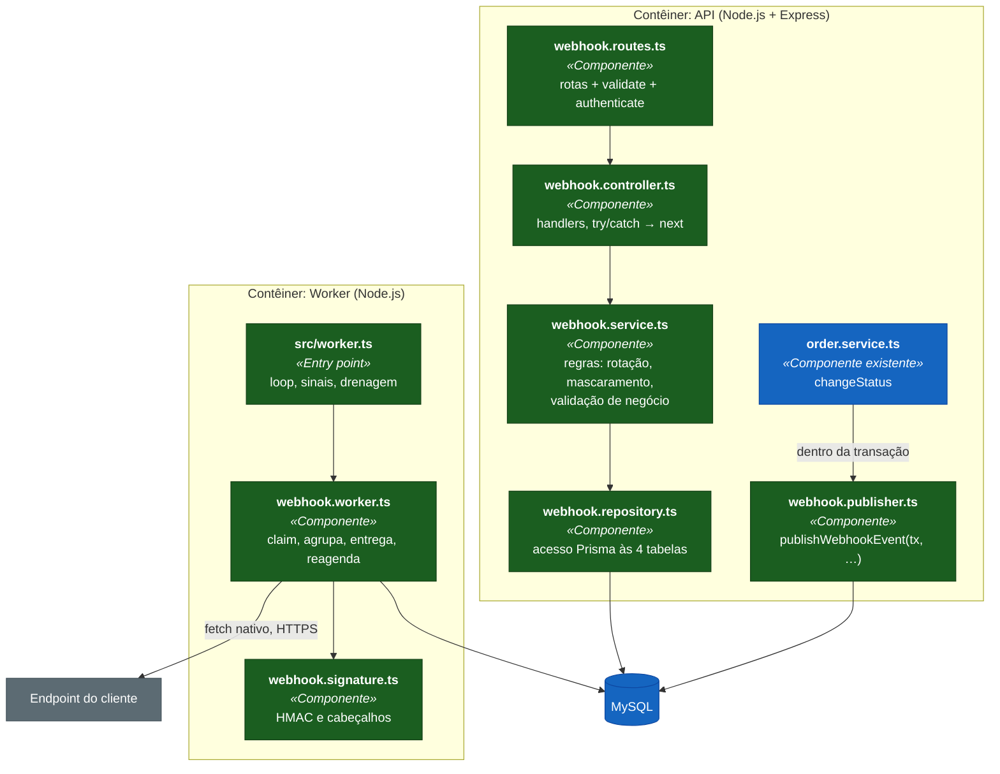
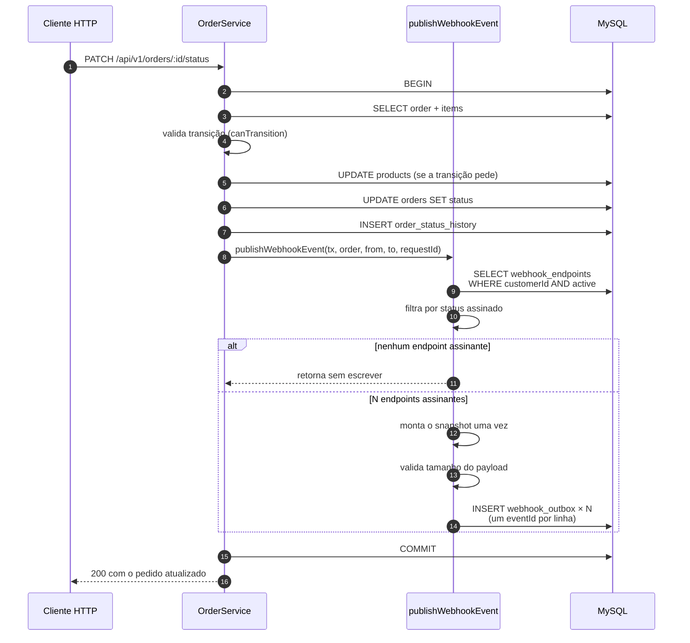
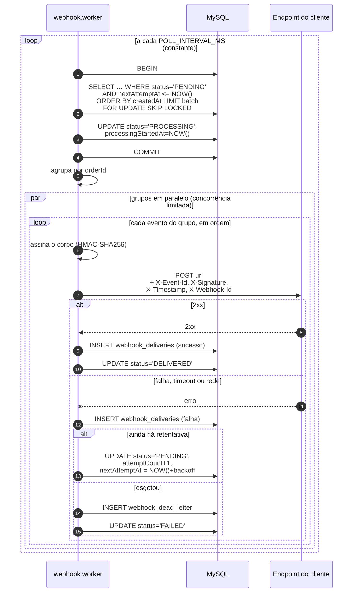
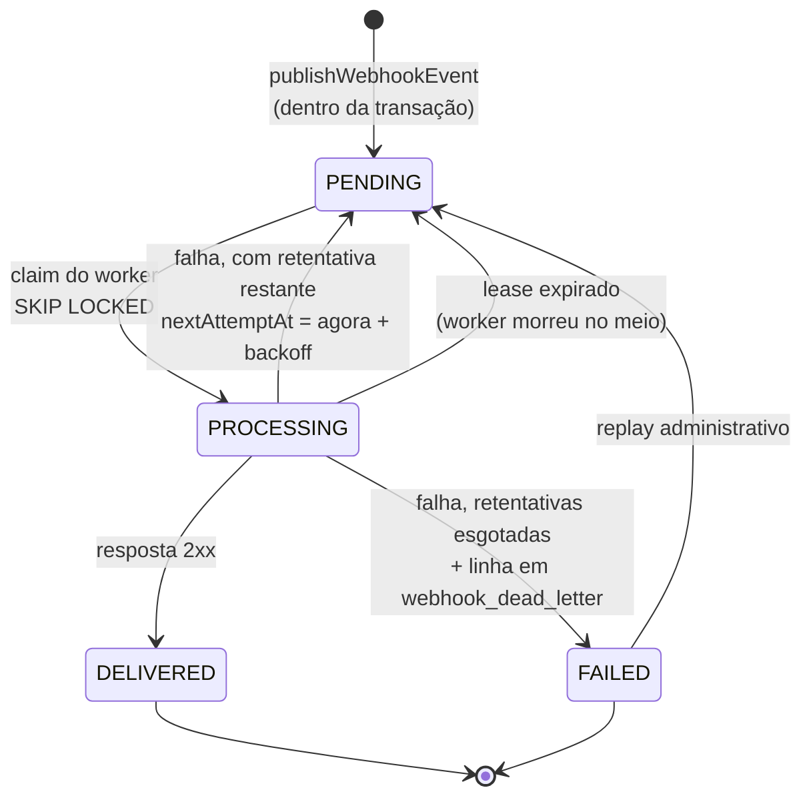
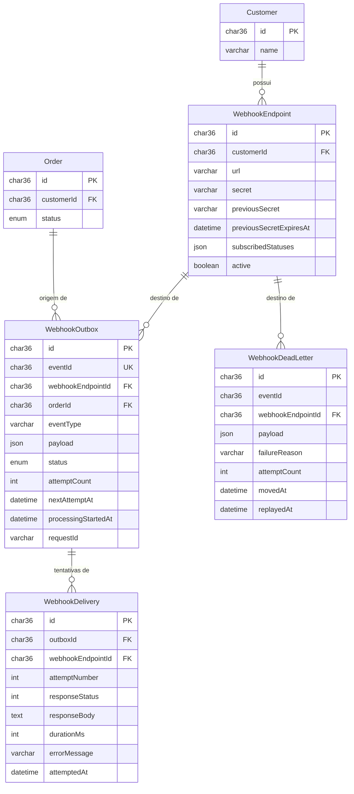

# FDD — Sistema de Webhooks de Notificação de Pedidos

|                |                                                                                     |
| -------------- | ----------------------------------------------------------------------------------- |
| **Status**     | Em revisão — aguardando a sessão de `[09:50]`                                        |
| **Data**       | 2026-08-09                                                                           |
| **Proposta**   | [`RFC.md`](RFC.md) · **Decisões** [`adrs/`](adrs/) · **Produto** [`PRD.md`](PRD.md)   |
| **Base de fatos** | [`processo/FATOS.md`](processo/FATOS.md)                                          |
| **Público**    | Quem vai implementar                                                                 |

> Este documento assume as decisões já tomadas. Ele responde **como construir**, não *por que assim* — a
> justificativa de cada escolha está no ADR correspondente, referenciado ao longo do texto.
>
> Marcações usadas: **`[derivado]`** para decisão de implementação que a reunião não tomou, com a procedência
> ao lado; **`[em aberto]`** para ponto que depende de decisão externa, com o identificador da questão.

---

## 1. Contexto e motivação técnica

O `OrderService.changeStatus` (`src/modules/orders/order.service.ts:126-179`) executa toda a mudança de status
dentro de uma única transação Prisma. Hoje ela valida a transição contra a máquina de estados, ajusta estoque
quando a transição pede, atualiza o pedido e insere no histórico. Não há nenhuma saída de dados: o sistema é
fechado.

A feature acrescenta uma quinta escrita nessa transação — o registro do evento — e um segundo processo Node
que consome esse registro e faz as chamadas HTTP. A restrição que organiza todo o desenho é que **a chamada
HTTP nunca acontece dentro da transação**.

Três características do repositório condicionam a implementação:

| Característica | Evidência | Consequência |
|---|---|---|
| Nenhum broker, cache ou fila | `docker-compose.yml:2-24` sobe só MySQL | A fila é uma tabela |
| Nenhum cliente HTTP nas dependências | `package.json:25-34` | Envio com `fetch` nativo do Node 20 |
| Transação exposta como `Prisma.TransactionClient` | `order.service.ts:131` | O gancho recebe o `tx`, não abre transação própria |

## 2. Objetivos técnicos

| # | Objetivo | Como se verifica |
|---|---|---|
| OBJ-01 | Registrar o evento atomicamente com a mudança de status | Teste que força erro na gravação e confirma que o status não mudou |
| OBJ-02 | Nunca fazer chamada HTTP de saída dentro da transação de pedidos | Inspeção do gancho: sem `fetch`, sem `await` de rede |
| OBJ-03 | Entregar em polling curto, sem dependência nova | `src/worker.ts` sobe com `npm run worker` e nenhuma linha nova em `dependencies` |
| OBJ-04 | Tolerar indisponibilidade do destino sem perder evento | Teste de destino recusando conexão: evento sobrevive e é reagendado |
| OBJ-05 | Permitir ao cliente verificar origem e integridade do payload | Assinatura reproduzível com o segredo do cadastro |
| OBJ-06 | Não alterar contrato nem latência de nenhum endpoint existente | Suíte atual passa sem modificação |
| OBJ-07 | Absorver o módulo na infraestrutura compartilhada sem tocá-la | `error.middleware.ts`, `validate.middleware.ts` e `response.ts` intocados |

## 3. Escopo e exclusões

**Entra:** tabelas de configuração, fila, histórico de tentativas e fila de mortos; módulo
`src/modules/webhooks` com os cinco arquivos do padrão; gancho na transação de `changeStatus`; entry point
`src/worker.ts`; nove endpoints HTTP; assinatura HMAC com rotação; retry com backoff e fila de mortos.

**Não entra:**

| Item | Situação | Origem |
|---|---|---|
| Alerta por e-mail quando o webhook falha | Fora desta fase | `[09:37] Larissa` |
| Painel visual para o cliente | Projeto separado do time de frontend | `[09:40] Larissa` |
| Recebimento de webhooks (inbound) | Só saída | `[09:02] Marcos` |
| Arquivamento e expurgo de linhas antigas | Fora do escopo da feature — `Q05` | `[09:08] Diego` |
| Limite de taxa de envio por cliente | Observar e decidir depois — `Q01` | `[09:39] Larissa` |
| Múltiplos workers e ordem global | Problema do futuro — `Q02` | `[09:13] Diego` |
| Desativação automática de endpoint com falha recorrente | Nunca discutido; consequência de o alerta estar fora | — |
| Circuit breaker por endpoint de destino | Nunca discutido. A resiliência desenhada é timeout, retry com backoff e fila de mortos, e cada evento é tentado sem memória do estado do destino. Um destino fora do ar consome as 5 retentativas de cada evento, em paralelo | — |
| Teste de carga e meta de vazão | Sem volume esperado na reunião, não há alvo contra o qual medir — ver a estratégia de validação no [PRD](PRD.md) | — |

Um evento de criação de pedido também **não entra**: `[09:43] Diego` define um único tipo de evento,
`order.status_changed`.

## 4. Componentes

### 4.1 Nível 3 — Componentes do módulo



`webhook.publisher.ts` é separado do repository de propósito: ele é a única peça do módulo que roda dentro de
uma transação alheia, e a única importada pelo módulo de pedidos. Ver
[ADR-006](adrs/ADR-006-reuso-dos-padroes-do-projeto.md).

### 4.2 Arquivos

| Caminho | Estado | Papel |
|---|---|---|
| `src/modules/webhooks/webhook.schemas.ts` | criar | Schemas Zod e tipos inferidos |
| `src/modules/webhooks/webhook.repository.ts` | criar | Acesso Prisma às quatro tabelas |
| `src/modules/webhooks/webhook.service.ts` | criar | Regras de negócio do CRUD e da rotação |
| `src/modules/webhooks/webhook.controller.ts` | criar | Handlers HTTP |
| `src/modules/webhooks/webhook.routes.ts` | criar | Montagem das rotas e middlewares |
| `src/modules/webhooks/webhook.publisher.ts` | criar | `publishWebhookEvent(tx, …)` |
| `src/modules/webhooks/webhook.worker.ts` | criar | Ciclo de entrega |
| `src/modules/webhooks/webhook.signature.ts` | criar | Assinatura e cabeçalhos |
| `src/modules/webhooks/webhook.constants.ts` | criar | Valores decididos na reunião |
| `src/worker.ts` | criar | Entry point do processo separado |
| `src/modules/orders/order.service.ts` | **alterar** | Uma chamada dentro da transação |
| `src/app.ts` | **alterar** | Montagem do módulo |
| `src/routes/index.ts` | **alterar** | Registro do router |
| `src/config/env.ts` | **alterar** | Variáveis de tuning |
| `src/shared/logger/index.ts` | **alterar** | `redact` de segredos |
| `prisma/schema.prisma` | **alterar** | Quatro models |
| `tests/setup.ts` | **alterar** | Limpeza das tabelas novas |
| `package.json` | **alterar** | Script `worker` |
| `src/middlewares/error.middleware.ts` | **não muda** | Já trata `AppError` |
| `src/middlewares/validate.middleware.ts` | **não muda** | Já converte `ZodError` |
| `src/shared/http/response.ts` | **não muda** | Já provê `paginated()` |
| `src/middlewares/auth.middleware.ts` | **não muda** | Já provê `authenticate` e `requireRole` |

## 5. Fluxos detalhados

### 5.1 Publicação do evento

Roda dentro da transação de `changeStatus`, imediatamente após a inserção no histórico.



Se qualquer passo do publisher lançar, a transação inteira sofre rollback e a mudança de status não acontece —
comportamento decidido em `[09:40] Bruno` e `[09:41] Diego`. Ver
[ADR-001](adrs/ADR-001-outbox-transacional-no-mysql.md).

O `requestId` da requisição de origem (`src/middlewares/request-logger.middleware.ts:6-8`) é gravado na linha
para permitir correlacionar a entrega com a chamada que a produziu.

### 5.2 Ciclo do worker e retentativa



O agrupamento por `orderId` preserva a ordem dentro de cada pedido e impede que um destino lento segure os
demais. Ver [ADR-002](adrs/ADR-002-worker-separado-em-polling.md).

### 5.3 Reconciliação de evento travado

O worker pode morrer entre o `POST` e a marcação do resultado. A linha fica em `PROCESSING` para sempre se
ninguém a reivindicar.

No início de cada ciclo, antes do claim, o worker devolve para `PENDING` toda linha em `PROCESSING` cujo
`processingStartedAt` seja mais antigo que o limite de lease (`WEBHOOK_LEASE_TIMEOUT_MS`). **`[derivado]`** — a reunião não tratou
o caso; procedência: leitura do código, já que `src/server.ts:13-21` encerra o processo sem drenar trabalho em
andamento.

Essa reconciliação é a **origem concreta** da duplicidade que o at-least-once assume: o evento pode ter sido
entregue antes da morte do processo e ser reenviado com o mesmo `X-Event-Id`. Ver
[ADR-005](adrs/ADR-005-entrega-at-least-once-com-event-id.md).

### 5.4 Estados do evento e entrada na fila de mortos



Os quatro estados são os que Diego enumerou em `[09:08]` — *"pendente, processando, falhou, entregue"*.
`FAILED` é terminal na outbox e sempre tem uma linha correspondente em `webhook_dead_letter`; as duas escritas
acontecem na mesma transação.

As duas arestas `PROCESSING → PENDING` têm gatilhos diferentes e consequências diferentes: a primeira consome
uma retentativa e agenda o futuro; a segunda **não** consome retentativa, porque não houve resposta do destino
— apenas devolve a linha para a fila.

### 5.5 Replay da fila de mortos

O replay copia a linha de volta para a outbox como `PENDING`, com `attemptCount` zerado e `nextAttemptAt`
imediato, preservando o `eventId` original. A entrada na fila de mortos não é apagada: recebe `replayedAt`,
para que o histórico não minta sobre o que aconteceu.

Preservar o `eventId` é deliberado: o cliente que já recebeu o evento na primeira rodada deve deduplicar o
reenvio pelo mesmo identificador.

### 5.6 O claim concorrente, em SQL

O diagrama de 5.2 resume três instruções numa caixa. Elas merecem estar escritas, porque a correção do sistema
inteiro depende de duas palavras no fim da primeira.

O ciclo abre reconciliando o que ficou para trás. É um `UPDATE` só, sem leitura prévia:

```sql
UPDATE `webhook_outbox`
   SET `status`              = 'PENDING',
       `processingStartedAt` = NULL,
       `updatedAt`           = NOW(3)
 WHERE `status` = 'PROCESSING'
   AND `processingStartedAt` <= ?;   -- Date.now() - WEBHOOK_LEASE_TIMEOUT_MS
```

O corte vem parametrizado do processo, não escrito na consulta: o valor vive em `WEBHOOK_LEASE_TIMEOUT_MS`
(9.1) e um literal no SQL o duplicaria. `attemptCount` não aparece na lista de colunas, e é essa ausência que
implementa a regra de 5.4 — lease expirado não consome retentativa (`AC-13`).

Em seguida vem o claim propriamente dito, numa transação curta que não faz nenhuma chamada de rede:

```sql
SET TRANSACTION ISOLATION LEVEL READ COMMITTED;
START TRANSACTION;

SELECT `id`
  FROM `webhook_outbox`
 WHERE `status` = 'PENDING'
   AND `nextAttemptAt` <= NOW(3)
 ORDER BY `createdAt` ASC
 LIMIT 50
   FOR UPDATE SKIP LOCKED;

UPDATE `webhook_outbox`
   SET `status`              = 'PROCESSING',
       `processingStartedAt` = NOW(3),
       `updatedAt`           = NOW(3)
 WHERE `id` IN (/* ids devolvidos acima */);

COMMIT;
```

`FOR UPDATE` toma lock exclusivo de linha, mantido até o `COMMIT`. `SKIP LOCKED` manda o MySQL pular, em vez de
esperar, toda linha que já esteja travada por outra transação — recurso do MySQL 8.0, a versão que
`docker-compose.yml:3` sobe. O `ORDER BY createdAt` é o que materializa a ordem que Diego prometeu em
`[09:12]`: *"ele processa em ordem de created_at do outbox"*. O `LIMIT` é `WEBHOOK_BATCH_SIZE`.

**Dois workers competindo.** Suponha W1 e W2 entrando no claim ao mesmo tempo. W1 chega primeiro e tranca as 50
linhas mais antigas. O `SELECT` de W2 encontra essas linhas, vê que estão travadas, pula, e devolve as 50
seguintes. Os dois seguem em frente com lotes disjuntos, e nenhum dos dois esperou pelo outro. Retire
`SKIP LOCKED` e W2 fica bloqueado até W1 committar — com ciclo de 2 segundos, o bloqueio vira fila de ciclos
empilhados. Retire `FOR UPDATE` também e o dano muda de natureza: os dois leem as mesmas 50 linhas, os dois
entregam, e a duplicata deixa de ser acidente de crash para virar comportamento de todo ciclo.

O desenho é de worker único (`[09:12] Diego`, `[09:13] Larissa`). O claim ainda precisa ser seguro porque
"único" é uma propriedade da implantação, não do código: durante uma troca de versão, o processo antigo e o
novo convivem por alguns segundos. **`[derivado]`** — procedência: escolha de implementação; a reunião não
tratou de implantação do worker.

**Por que READ COMMITTED.** Sob `REPEATABLE READ`, o padrão do MySQL, uma leitura bloqueante por faixa trava
mais do que as linhas que devolve — ela protege também os intervalos do índice que percorreu. Quem insere
exatamente nessa faixa é a transação de `changeStatus`, pelo publisher de 5.1. Rebaixar a transação de claim
para `READ COMMITTED` restringe o lock às linhas efetivamente lidas e tira o caminho quente do OMS de trás de
uma fila do worker. **`[derivado]`** — procedência: leitura do código; é a consequência de o publisher escrever
na mesma tabela que o claim varre.

**Nota de implementação.** Prisma 5 não expõe `SKIP LOCKED` na API tipada (`package.json:26`), então as duas
instruções saem por `$queryRaw` e `$executeRaw` dentro de `prisma.$transaction`. Uma consequência prática:
`@updatedAt` é aplicado pelo cliente Prisma, não pelo banco, e por isso a coluna aparece explicitamente nos
dois `UPDATE` acima.

## 6. Modelo de dados

### 6.1 Convenções herdadas

Levantadas do schema atual antes de propor qualquer model. Cada uma tem precedente verificável:

| Convenção | Precedente |
|---|---|
| Chave primária `String @id @default(uuid()) @db.Char(36)` | `prisma/schema.prisma:26`, `:41`, `:57`, `:75` — e `[09:51] Larissa`: *"UUID, segue o padrão do resto do projeto. Tudo é uuid."* |
| Tabela em `snake_case` via `@@map`, colunas em camelCase **sem** `@map` | `prisma/schema.prisma:37`, `:53`, `:96`; confirmado em `prisma/migrations/20260519182739_init/migration.sql` |
| `createdAt DateTime @default(now())` e `updatedAt DateTime @updatedAt` | `prisma/schema.prisma:32-33` |
| Coluna `Json` para estrutura sem tabela própria | `Customer.address` — `prisma/schema.prisma:46` |
| Enum em `SCREAMING_SNAKE` | `UserRole` `:11-14`, `OrderStatus` `:16-23` |
| Índice explícito em coluna de filtro | `@@index([status])`, `@@index([createdAt])` em `Order` — `:92-95` |

A exceção conhecida do projeto é `OrderNumberSequence` (`:133-138`), com `id Int @id @default(1)`. É uma
tabela de contador, não de domínio, e não serve de precedente.

### 6.2 Entidades



### 6.3 Models propostos

```prisma
enum WebhookEventStatus {
  PENDING
  PROCESSING
  DELIVERED
  FAILED
}

model WebhookEndpoint {
  id                      String    @id @default(uuid()) @db.Char(36)
  customerId              String    @db.Char(36)
  url                     String    @db.VarChar(2048)
  secret                  String    @db.VarChar(80)
  previousSecret          String?   @db.VarChar(80)
  previousSecretExpiresAt DateTime?
  subscribedStatuses      Json
  active                  Boolean   @default(true)
  createdAt               DateTime  @default(now())
  updatedAt               DateTime  @updatedAt

  customer   Customer            @relation(fields: [customerId], references: [id])
  outbox     WebhookOutbox[]
  deadLetter WebhookDeadLetter[]

  @@index([customerId, active])
  @@map("webhook_endpoints")
}

model WebhookOutbox {
  id                  String             @id @default(uuid()) @db.Char(36)
  eventId             String             @unique @db.Char(36)
  webhookEndpointId   String             @db.Char(36)
  orderId             String             @db.Char(36)
  eventType           String             @db.VarChar(64)
  payload             Json
  status              WebhookEventStatus @default(PENDING)
  attemptCount        Int                @default(0)
  nextAttemptAt       DateTime           @default(now())
  processingStartedAt DateTime?
  requestId           String?            @db.VarChar(64)
  createdAt           DateTime           @default(now())
  updatedAt           DateTime           @updatedAt

  endpoint   WebhookEndpoint   @relation(fields: [webhookEndpointId], references: [id])
  order      Order             @relation(fields: [orderId], references: [id], onDelete: Cascade)
  deliveries WebhookDelivery[]

  @@index([status, nextAttemptAt])
  @@index([status, processingStartedAt])
  @@index([webhookEndpointId, createdAt])
  @@index([orderId])
  @@map("webhook_outbox")
}

model WebhookDelivery {
  id                String   @id @default(uuid()) @db.Char(36)
  outboxId          String   @db.Char(36)
  webhookEndpointId String   @db.Char(36)
  attemptNumber     Int
  responseStatus    Int?
  responseBody      String?  @db.Text
  durationMs        Int
  errorMessage      String?  @db.VarChar(500)
  attemptedAt       DateTime @default(now())

  outbox WebhookOutbox @relation(fields: [outboxId], references: [id], onDelete: Cascade)

  @@index([webhookEndpointId, attemptedAt])
  @@index([outboxId])
  @@map("webhook_deliveries")
}

model WebhookDeadLetter {
  id                String    @id @default(uuid()) @db.Char(36)
  eventId           String    @db.Char(36)
  webhookEndpointId String    @db.Char(36)
  orderId           String    @db.Char(36)
  eventType         String    @db.VarChar(64)
  payload           Json
  failureReason     String    @db.VarChar(500)
  attemptCount      Int
  movedAt           DateTime  @default(now())
  replayedAt        DateTime?
  replayedById      String?   @db.Char(36)

  endpoint WebhookEndpoint @relation(fields: [webhookEndpointId], references: [id])

  @@index([webhookEndpointId, movedAt])
  @@index([replayedAt])
  @@map("webhook_dead_letter")
}
```

`Customer` e `Order` ganham os campos de relação inversa (`webhookEndpoints`, `webhookOutbox`). São adições ao
schema, sem alteração de coluna existente — a migração é **aditiva**.

### 6.4 Justificativa de cada índice

| Índice | Consulta que ele serve |
|---|---|
| `webhook_endpoints [customerId, active]` | O caminho quente: dentro da transação de `changeStatus`, buscar endpoints ativos do cliente |
| `webhook_outbox [status, nextAttemptAt]` | O claim do worker a cada ciclo |
| `webhook_outbox [status, processingStartedAt]` | A reconciliação de lease no início do ciclo |
| `webhook_outbox [webhookEndpointId, createdAt]` | Listagem de entregas de um endpoint |
| `webhook_outbox [orderId]` | Depuração: todos os eventos de um pedido |
| `webhook_deliveries [webhookEndpointId, attemptedAt]` | `GET /webhooks/:id/deliveries`, ordenado por recência |
| `webhook_dead_letter [webhookEndpointId, movedAt]` | Listagem administrativa |
| `webhook_dead_letter [replayedAt]` | Separar o que ainda não foi reprocessado |

**Índice que deliberadamente não existe:** nenhum sobre `url`. Não há consulta por URL em nenhum fluxo — o
endpoint é sempre alcançado por identificador ou por cliente.

### 6.5 Limpeza nos testes

`tests/setup.ts:9-15` apaga as tabelas no `beforeEach` em ordem de chave estrangeira. As quatro tabelas novas
entram **antes** de `order` e `customer`, nesta ordem:

```
webhookDelivery → webhookDeadLetter → webhookOutbox → webhookEndpoint →
orderStatusHistory → orderItem → order → orderNumberSequence → product → customer → user
```

Omitir esse passo produz falha intermitente em outro módulo, não no de webhooks — e com
`fileParallelism: false` (`vitest.config.ts:4-18`) a causa fica difícil de rastrear.

### 6.6 A migração, em SQL

O que `npx prisma migrate dev` gera a partir dos models de 6.3, no dialeto MySQL e no formato do arquivo que já
está no repositório (`prisma/migrations/20260519182739_init/migration.sql`). Revisar o DDL antes de aplicá-lo é
barato e evita descobrir no ambiente errado que um índice não nasceu.

```sql
-- CreateTable
CREATE TABLE `webhook_endpoints` (
    `id` CHAR(36) NOT NULL,
    `customerId` CHAR(36) NOT NULL,
    `url` VARCHAR(2048) NOT NULL,
    `secret` VARCHAR(80) NOT NULL,
    `previousSecret` VARCHAR(80) NULL,
    `previousSecretExpiresAt` DATETIME(3) NULL,
    `subscribedStatuses` JSON NOT NULL,
    `active` BOOLEAN NOT NULL DEFAULT true,
    `createdAt` DATETIME(3) NOT NULL DEFAULT CURRENT_TIMESTAMP(3),
    `updatedAt` DATETIME(3) NOT NULL,

    INDEX `webhook_endpoints_customerId_active_idx`(`customerId`, `active`),
    PRIMARY KEY (`id`)
) DEFAULT CHARACTER SET utf8mb4 COLLATE utf8mb4_unicode_ci;

-- CreateTable
CREATE TABLE `webhook_outbox` (
    `id` CHAR(36) NOT NULL,
    `eventId` CHAR(36) NOT NULL,
    `webhookEndpointId` CHAR(36) NOT NULL,
    `orderId` CHAR(36) NOT NULL,
    `eventType` VARCHAR(64) NOT NULL,
    `payload` JSON NOT NULL,
    `status` ENUM('PENDING', 'PROCESSING', 'DELIVERED', 'FAILED') NOT NULL DEFAULT 'PENDING',
    `attemptCount` INTEGER NOT NULL DEFAULT 0,
    `nextAttemptAt` DATETIME(3) NOT NULL DEFAULT CURRENT_TIMESTAMP(3),
    `processingStartedAt` DATETIME(3) NULL,
    `requestId` VARCHAR(64) NULL,
    `createdAt` DATETIME(3) NOT NULL DEFAULT CURRENT_TIMESTAMP(3),
    `updatedAt` DATETIME(3) NOT NULL,

    UNIQUE INDEX `webhook_outbox_eventId_key`(`eventId`),
    INDEX `webhook_outbox_status_nextAttemptAt_idx`(`status`, `nextAttemptAt`),
    INDEX `webhook_outbox_status_processingStartedAt_idx`(`status`, `processingStartedAt`),
    INDEX `webhook_outbox_webhookEndpointId_createdAt_idx`(`webhookEndpointId`, `createdAt`),
    INDEX `webhook_outbox_orderId_idx`(`orderId`),
    PRIMARY KEY (`id`)
) DEFAULT CHARACTER SET utf8mb4 COLLATE utf8mb4_unicode_ci;

-- CreateTable
CREATE TABLE `webhook_deliveries` (
    `id` CHAR(36) NOT NULL,
    `outboxId` CHAR(36) NOT NULL,
    `webhookEndpointId` CHAR(36) NOT NULL,
    `attemptNumber` INTEGER NOT NULL,
    `responseStatus` INTEGER NULL,
    `responseBody` TEXT NULL,
    `durationMs` INTEGER NOT NULL,
    `errorMessage` VARCHAR(500) NULL,
    `attemptedAt` DATETIME(3) NOT NULL DEFAULT CURRENT_TIMESTAMP(3),

    INDEX `webhook_deliveries_webhookEndpointId_attemptedAt_idx`(`webhookEndpointId`, `attemptedAt`),
    INDEX `webhook_deliveries_outboxId_idx`(`outboxId`),
    PRIMARY KEY (`id`)
) DEFAULT CHARACTER SET utf8mb4 COLLATE utf8mb4_unicode_ci;

-- CreateTable
CREATE TABLE `webhook_dead_letter` (
    `id` CHAR(36) NOT NULL,
    `eventId` CHAR(36) NOT NULL,
    `webhookEndpointId` CHAR(36) NOT NULL,
    `orderId` CHAR(36) NOT NULL,
    `eventType` VARCHAR(64) NOT NULL,
    `payload` JSON NOT NULL,
    `failureReason` VARCHAR(500) NOT NULL,
    `attemptCount` INTEGER NOT NULL,
    `movedAt` DATETIME(3) NOT NULL DEFAULT CURRENT_TIMESTAMP(3),
    `replayedAt` DATETIME(3) NULL,
    `replayedById` CHAR(36) NULL,

    INDEX `webhook_dead_letter_webhookEndpointId_movedAt_idx`(`webhookEndpointId`, `movedAt`),
    INDEX `webhook_dead_letter_replayedAt_idx`(`replayedAt`),
    PRIMARY KEY (`id`)
) DEFAULT CHARACTER SET utf8mb4 COLLATE utf8mb4_unicode_ci;

-- AddForeignKey
ALTER TABLE `webhook_endpoints` ADD CONSTRAINT `webhook_endpoints_customerId_fkey` FOREIGN KEY (`customerId`) REFERENCES `customers`(`id`) ON DELETE RESTRICT ON UPDATE CASCADE;

-- AddForeignKey
ALTER TABLE `webhook_outbox` ADD CONSTRAINT `webhook_outbox_webhookEndpointId_fkey` FOREIGN KEY (`webhookEndpointId`) REFERENCES `webhook_endpoints`(`id`) ON DELETE RESTRICT ON UPDATE CASCADE;

-- AddForeignKey
ALTER TABLE `webhook_outbox` ADD CONSTRAINT `webhook_outbox_orderId_fkey` FOREIGN KEY (`orderId`) REFERENCES `orders`(`id`) ON DELETE CASCADE ON UPDATE CASCADE;

-- AddForeignKey
ALTER TABLE `webhook_deliveries` ADD CONSTRAINT `webhook_deliveries_outboxId_fkey` FOREIGN KEY (`outboxId`) REFERENCES `webhook_outbox`(`id`) ON DELETE CASCADE ON UPDATE CASCADE;

-- AddForeignKey
ALTER TABLE `webhook_dead_letter` ADD CONSTRAINT `webhook_dead_letter_webhookEndpointId_fkey` FOREIGN KEY (`webhookEndpointId`) REFERENCES `webhook_endpoints`(`id`) ON DELETE RESTRICT ON UPDATE CASCADE;
```

O DDL esconde quatro detalhes que valem revisão.

O enum não vira tipo. Em MySQL, `WebhookEventStatus` é `ENUM(...)` inline na coluna, exatamente como
`orders.status` no arquivo de init (`migration.sql:54`). Acrescentar um quinto estado depois exige
`ALTER TABLE` sobre a tabela inteira, e convém lembrar disso antes de propor um.

Os campos de relação inversa não geram nada. `Customer.webhookEndpoints` e `Order.webhookOutbox` existem só do
lado do Prisma; o DDL correspondente é o índice da chave estrangeira do lado filho. Por isso a migração é
aditiva de verdade: nenhuma linha do arquivo toca uma tabela existente, exceto pelas duas `ALTER TABLE` que
apenas acrescentam constraint.

`webhook_deliveries.webhookEndpointId` não tem chave estrangeira. É deliberado, e é o único campo do pacote
nessa condição: o model de 6.3 não declara relação para ele. A coluna existe para servir o índice
`[webhookEndpointId, attemptedAt]` de `GET /webhooks/:id/deliveries` sem exigir junção com a outbox. O preço é
que nada no banco garante a coerência dela; quem grava é o worker, a partir da linha que acabou de reivindicar.

E a migração precisa do shadow database. `prisma/schema.prisma:8` declara `shadowDatabaseUrl`, então
`migrate dev` exige a segunda URL configurada — ausência dela quebra a geração, não a aplicação.

### 6.7 Política de exclusão e integridade referencial

Prisma gera `ON DELETE RESTRICT` para toda relação obrigatória sem `onDelete` explícito. É o que o schema atual
já faz em `orders.customerId` e `orders.createdById` (`migration.sql:110`, `:113`), e é o que 6.6 repete. A
consequência é que apagar não é mais uma operação livre — e duas superfícies sentem isso.

**Remover um endpoint que ainda tem eventos.** `DELETE /api/v1/webhooks/:id` é remoção definitiva (7.5). Com
`RESTRICT` nas duas chaves que apontam para `webhook_endpoints`, a instrução falha enquanto existir uma linha
de outbox ou de fila de mortos daquele cadastro — inclusive linhas já entregues, que só existem como
histórico. Prisma devolve `P2003` nesse caso, e `error.middleware.ts:37-54` trata apenas `P2002` e `P2025`: o
erro cai no ramo final e vira `500 INTERNAL_SERVER_ERROR`. Uma remoção perfeitamente previsível responderia
como defeito de servidor.

O serviço resolve isso antes do banco, numa transação só, na ordem das chaves:

1. Contar linhas em `PENDING` ou `PROCESSING` do endpoint. Se houver alguma, recusar com `409`
   `WEBHOOK_HAS_PENDING_EVENTS` e não apagar nada. São eventos que perderiam o destino no meio do caminho, e
   descartá-los em silêncio contraria `[09:40] Bruno`: *"Não pode ter caso de status mudar e evento não sair"*.
2. Apagar as linhas de outbox restantes — todas terminais. As tentativas em `webhook_deliveries` vão junto pelo
   `ON DELETE CASCADE`, no mesmo arranjo de `order_items` e `order_status_history` sob `orders`.
3. Apagar as linhas de `webhook_dead_letter` do endpoint.
4. Apagar o endpoint.

Se, entre a contagem e o passo 4, o publisher inserir uma linha nova para aquele endpoint, o `RESTRICT` derruba
a transação inteira. O serviço captura `P2003` e o converte no mesmo `409` do passo 1, e é assim que
`error.middleware.ts` permanece intocado como 4.2 promete.

Vale reler o que a operação ganha em troca: o passo 2 destrói histórico de entrega e o passo 3 destrói
evidência de falha. Quem quer suspender sem perder rastro usa `PATCH { "active": false }` — o campo que Bruno
enumerou em `[09:21]`, e o caminho recomendado em 7.5.

**Apagar um pedido.** Este é o efeito colateral que quase passa. `OrderService.delete`
(`order.service.ts:181-192`) permite remover pedido em `PENDING` ou `CANCELLED`. Uma transição para
`CANCELLED` gera evento; com `RESTRICT` em `webhook_outbox.orderId`, `DELETE /api/v1/orders/:id` passaria a
falhar — de novo com `P2003` e de novo como `500` — para qualquer pedido que já tenha notificado alguém. Seria
regressão em endpoint existente, contra `OBJ-06`.

Por isso `webhook_outbox.orderId` leva `onDelete: Cascade`, e é a única chave do pacote a divergir do padrão
`RESTRICT`. O precedente é o próprio schema: `order_items` e `order_status_history` cascateiam de `orders`
(`prisma/schema.prisma:108`, `:125`), porque são satélites do pedido e não sobrevivem a ele. A linha de outbox
é da mesma natureza. **`[derivado]`** — procedência: leitura do código; a reunião não tratou de exclusão de
pedido.

Fica um resíduo honesto: apagar um pedido cancelado descarta os eventos dele que ainda não saíram, e não
recolhe os que já saíram. O `webhook_dead_letter` não cascateia por `orderId` — a coluna existe lá sem chave
estrangeira, como em `webhook_deliveries` — então a evidência de falha sobrevive ao pedido.

**Apagar um cliente.** Nada muda de forma perceptível. `webhook_endpoints.customerId` é `RESTRICT`, mas
`orders.customerId` já era (`migration.sql:110`): um cliente com pedidos nunca pôde ser apagado, e um cliente
com webhooks quase sempre tem pedidos. A tabela nova não introduz caso novo, apenas mais um motivo para o
mesmo bloqueio.

## 7. Contratos públicos

Todas as rotas ficam sob `/api/v1` (`src/app.ts:67`). O envelope de erro é o do projeto —
`{ "error": { "code", "message", "details?" } }` (`src/middlewares/error.middleware.ts:15-24`) — e listagens
usam `{ "data", "pagination" }` (`src/shared/http/response.ts:8-11`). Recurso único é serializado cru, como
nos demais módulos (`src/modules/customers/customer.controller.ts:21`).

O `secret` aparece **íntegro apenas duas vezes**: na criação e na rotação. Em toda leitura vem mascarado.

### 7.1 `POST /api/v1/webhooks` — cadastrar endpoint

`authenticate`

```jsonc
// request
{
  "customerId": "0f1b6a9e-6b1f-4c3a-9a4e-2f1c8d0b7e33",
  "url": "https://atlas.example.com/hooks/oms",
  "subscribedStatuses": ["SHIPPED", "DELIVERED"]
}
```

```jsonc
// 201 Created
{
  "id": "b7c2f4a1-3d5e-4f80-9c11-6a2d8e4b0f97",
  "customerId": "0f1b6a9e-6b1f-4c3a-9a4e-2f1c8d0b7e33",
  "url": "https://atlas.example.com/hooks/oms",
  "secret": "whsec_4f2b8c1d9e07a35f6b4c2d8e1f0a9b3c5d7e2f4a6b8c0d1e3f5a7b9c1d3e5f7a",
  "subscribedStatuses": ["SHIPPED", "DELIVERED"],
  "active": true,
  "createdAt": "2026-08-09T14:02:11.482Z",
  "updatedAt": "2026-08-09T14:02:11.482Z"
}
```

| Status | Quando |
|---|---|
| `201` | Criado. **Única resposta que traz o `secret` íntegro** |
| `400` | `VALIDATION_ERROR` — corpo inválido, URL malformada ou não-`https` |
| `401` | Sem token válido |
| `422` | `WEBHOOK_CUSTOMER_NOT_FOUND`, `WEBHOOK_INVALID_STATUS`, `WEBHOOK_NO_STATUS_SUBSCRIBED` |

A exigência de `https` é validação de schema, exatamente como Sofia classificou em `[09:23]`: *"Isso na
verdade nem é decisão arquitetural, é só uma validação no schema Zod."* Uma URL `http` produz portanto
`VALIDATION_ERROR`, com o caminho do campo em `details` — o mesmo formato que os outros módulos já devolvem.

### 7.2 `GET /api/v1/webhooks` — listar por cliente

`authenticate` · `?customerId=<uuid>` obrigatório · `?page` e `?pageSize` opcionais

```http
GET /api/v1/webhooks?customerId=0f1b6a9e-6b1f-4c3a-9a4e-2f1c8d0b7e33&page=1&pageSize=20 HTTP/1.1
Authorization: Bearer <token>
```

```jsonc
// 200 OK
{
  "data": [
    {
      "id": "b7c2f4a1-3d5e-4f80-9c11-6a2d8e4b0f97",
      "customerId": "0f1b6a9e-6b1f-4c3a-9a4e-2f1c8d0b7e33",
      "url": "https://atlas.example.com/hooks/oms",
      "secret": "whsec_****3e5f7a",
      "subscribedStatuses": ["SHIPPED", "DELIVERED"],
      "active": true,
      "createdAt": "2026-08-09T14:02:11.482Z",
      "updatedAt": "2026-08-09T14:02:11.482Z"
    }
  ],
  "pagination": { "page": 1, "pageSize": 20, "total": 1, "totalPages": 1 }
}
```

| Status | Quando |
|---|---|
| `200` | Lista, possivelmente vazia. `secret` mascarado em cada item |
| `400` | `VALIDATION_ERROR` — `customerId` ausente, fora do formato UUID, ou `pageSize` acima de 100 |
| `401` | Sem token válido |

`customerId` inexistente devolve `200` com lista vazia, não `422`. `WEBHOOK_CUSTOMER_NOT_FOUND` é da criação,
onde o identificador vem no corpo e nomeia o dono do cadastro; aqui ele é filtro.

`customerId` vem na consulta e nunca do token — `[09:32] Larissa`: *"o customer_id é passado no body ou no
path. Não vem do JWT."* Ver [ADR-008](adrs/ADR-008-controle-de-acesso-dos-endpoints.md).

### 7.3 `GET /api/v1/webhooks/:id` — detalhe

`authenticate` · sem corpo

```http
GET /api/v1/webhooks/b7c2f4a1-3d5e-4f80-9c11-6a2d8e4b0f97 HTTP/1.1
Authorization: Bearer <token>
```

```jsonc
// 200 OK — mesmo objeto do item da listagem
{
  "id": "b7c2f4a1-3d5e-4f80-9c11-6a2d8e4b0f97",
  "customerId": "0f1b6a9e-6b1f-4c3a-9a4e-2f1c8d0b7e33",
  "url": "https://atlas.example.com/hooks/oms",
  "secret": "whsec_****3e5f7a",
  "subscribedStatuses": ["SHIPPED", "DELIVERED"],
  "active": true,
  "createdAt": "2026-08-09T14:02:11.482Z",
  "updatedAt": "2026-08-09T14:02:11.482Z"
}
```

| Status | Quando |
|---|---|
| `200` | Encontrado. `secret` mascarado |
| `400` | `VALIDATION_ERROR` — `:id` fora do formato UUID |
| `401` | Sem token válido |
| `404` | `WEBHOOK_NOT_FOUND` |

O recurso é serializado cru, sem envelope, como nos demais módulos
(`src/modules/customers/customer.controller.ts:21`). É o mesmo objeto que a listagem devolve dentro de `data`,
e é intencional que sejam idênticos: o cliente que já sabe ler um sabe ler o outro.

### 7.4 `PATCH /api/v1/webhooks/:id` — editar

`authenticate` · corpo parcial com `url`, `subscribedStatuses` e `active`

```jsonc
// request — desativar sem apagar
{ "active": false }
```

```jsonc
// 200 OK — mesmo formato do detalhe, secret mascarado
{
  "id": "b7c2f4a1-3d5e-4f80-9c11-6a2d8e4b0f97",
  "url": "https://atlas.example.com/hooks/oms",
  "secret": "whsec_****3e5f7a",
  "subscribedStatuses": ["SHIPPED", "DELIVERED"],
  "active": false,
  "updatedAt": "2026-08-09T15:40:03.117Z"
}
```

| Status | Quando |
|---|---|
| `200` | Atualizado. `secret` mascarado |
| `400` | `VALIDATION_ERROR` — `:id` fora do formato UUID, URL malformada ou não-`https` |
| `401` | Sem token válido |
| `404` | `WEBHOOK_NOT_FOUND` |
| `422` | `WEBHOOK_INVALID_STATUS`, `WEBHOOK_NO_STATUS_SUBSCRIBED` |

`customerId` **não** é editável: mover um endpoint de cliente mudaria o destino de eventos já na fila. Um corpo
que o traga é ignorado pelo schema, não recusado — `PATCH` parcial no molde de
`updateCustomerSchema` (`customer.schemas.ts:23`).

### 7.5 `DELETE /api/v1/webhooks/:id` — remover

`authenticate` · sem corpo · `204 No Content`, também sem corpo — o padrão de `customer.controller.ts:45-52`

```http
DELETE /api/v1/webhooks/b7c2f4a1-3d5e-4f80-9c11-6a2d8e4b0f97 HTTP/1.1
Authorization: Bearer <token>
```

| Status | Quando |
|---|---|
| `204` | Removido. Sem corpo |
| `400` | `VALIDATION_ERROR` — `:id` fora do formato UUID |
| `401` | Sem token válido |
| `404` | `WEBHOOK_NOT_FOUND` |
| `409` | `WEBHOOK_HAS_PENDING_EVENTS` — há evento em `PENDING` ou `PROCESSING` para este endpoint |

Remoção é definitiva, e leva junto o histórico de entregas e as entradas na fila de mortos daquele cadastro —
a mecânica está em 6.7. Enquanto restar evento por entregar, a remoção é recusada em vez de descartar o
evento. Para suspender temporariamente existe `active`, o campo que Bruno enumerou em `[09:21]`: o cadastro
sobrevive, as linhas de outbox pendentes também, e o worker as descarta na entrega registrando
`WEBHOOK_ENDPOINT_INACTIVE` como motivo.

### 7.6 `POST /api/v1/webhooks/:id/rotate-secret` — rotacionar segredo

`authenticate` · sem corpo

```http
POST /api/v1/webhooks/b7c2f4a1-3d5e-4f80-9c11-6a2d8e4b0f97/rotate-secret HTTP/1.1
Authorization: Bearer <token>
```

```jsonc
// 200 OK
{
  "id": "b7c2f4a1-3d5e-4f80-9c11-6a2d8e4b0f97",
  "secret": "whsec_9a1c3e5f7b9d1f3a5c7e9b1d3f5a7c9e1b3d5f7a9c1e3b5d7f9a1c3e5b7d9f1a",
  "previousSecretExpiresAt": "2026-08-10T15:40:03.117Z"
}
```

| Status | Quando |
|---|---|
| `200` | Rotacionado. **Segunda e última resposta que traz o `secret` íntegro** |
| `400` | `VALIDATION_ERROR` — `:id` fora do formato UUID |
| `401` | Sem token válido |
| `404` | `WEBHOOK_NOT_FOUND` |

A resposta é enxuta de propósito: só o identificador, o segredo novo e o fim da janela. Devolver o cadastro
inteiro colocaria o segredo ao lado de campos que aparecem em toda leitura, e é justamente essa separação que
mantém a regra do começo da seção verificável em `AC-17`.

Durante a janela, **as duas assinaturas viajam no mesmo cabeçalho**, separadas por vírgula. É o que torna
operacional o que Sofia pediu em `[09:21]`: *"a antiga fica válida por 24 horas em paralelo, pra ele ter tempo
de migrar os sistemas dele."*

**Rotacionar durante a janela é permitido.** A nova rotação promove o segredo atual a anterior, descarta o
anterior antigo e reinicia a contagem. **`[derivado]`** — procedência: escolha de implementação. Bloquear
rotação durante a janela pareceria mais seguro e seria um erro: o cenário que justifica rotacionar é
credencial vazada, e nesse cenário bloquear por 24 horas desativa justamente o caminho de emergência que a
funcionalidade existe para oferecer.

### 7.7 `GET /api/v1/webhooks/:id/deliveries` — histórico de entregas

`authenticate` · `?page`, `?pageSize` (padrão 20, teto 100)

```http
GET /api/v1/webhooks/b7c2f4a1-3d5e-4f80-9c11-6a2d8e4b0f97/deliveries?page=1&pageSize=20 HTTP/1.1
Authorization: Bearer <token>
```

```jsonc
// 200 OK
{
  "data": [
    {
      "id": "d41c8a02-77b3-4e19-9f5c-0b8e2a6d4c31",
      "eventId": "e3a9f1c7-5d2b-4a86-b0e4-9c7f1a3d5b82",
      "orderId": "7c9e1b3d-5f7a-4c1e-9b3d-5f7a9c1e3b5d",
      "attemptNumber": 2,
      "responseStatus": 503,
      "responseBody": "<html>Service Unavailable</html>",
      "durationMs": 1042,
      "errorMessage": null,
      "attemptedAt": "2026-08-09T14:08:11.004Z"
    }
  ],
  "pagination": { "page": 1, "pageSize": 20, "total": 37, "totalPages": 2 }
}
```

| Status | Quando |
|---|---|
| `200` | Histórico do endpoint, da tentativa mais recente para a mais antiga. Lista vazia se nunca houve entrega |
| `400` | `VALIDATION_ERROR` — `:id` fora do formato UUID, ou `pageSize` acima de 100 |
| `401` | Sem token válido |
| `404` | `WEBHOOK_NOT_FOUND` — o endpoint precisa existir para que a lista signifique alguma coisa |

Marcos pediu em `[09:34]` *"os últimos 100 webhooks que vocês mandaram pra mim, sucesso/falha, payload,
response, tempo de resposta"*. O teto de 100 vira o `pageSize` máximo, e a paginação segue o padrão do
projeto. O `payload` não se repete em cada tentativa — ele é o mesmo para todas e vem no evento; a linha
carrega o resultado.

`responseBody` é truncado na gravação para não inflar a tabela com página de erro HTML. **`[derivado]`** —
procedência: escolha de implementação; a reunião não tratou o tamanho da resposta armazenada.

### 7.8 `GET /api/v1/admin/webhooks/dead-letter` — listar fila de mortos

`authenticate` · `requireRole('ADMIN')` · `?webhookEndpointId`, `?replayed=true|false`, `?page`, `?pageSize`

```http
GET /api/v1/admin/webhooks/dead-letter?replayed=false&page=1&pageSize=20 HTTP/1.1
Authorization: Bearer <token>
```

```jsonc
// 200 OK
{
  "data": [
    {
      "id": "a1b2c3d4-e5f6-4718-9a0b-1c2d3e4f5a6b",
      "eventId": "e3a9f1c7-5d2b-4a86-b0e4-9c7f1a3d5b82",
      "webhookEndpointId": "b7c2f4a1-3d5e-4f80-9c11-6a2d8e4b0f97",
      "orderId": "7c9e1b3d-5f7a-4c1e-9b3d-5f7a9c1e3b5d",
      "eventType": "order.status_changed",
      "failureReason": "WEBHOOK_DELIVERY_TIMEOUT",
      "attemptCount": 6,
      "movedAt": "2026-08-10T04:44:02.900Z",
      "replayedAt": null
    }
  ],
  "pagination": { "page": 1, "pageSize": 20, "total": 3, "totalPages": 1 }
}
```

| Status | Quando |
|---|---|
| `200` | Lista, da entrada mais recente para a mais antiga |
| `400` | `VALIDATION_ERROR` — `webhookEndpointId` fora do formato UUID, `replayed` diferente de `true` ou `false`, `pageSize` acima de 100 |
| `401` | Sem token válido |
| `403` | `FORBIDDEN` — role diferente de `ADMIN` |

`payload` não vem na listagem, mesmo estando na tabela. Ele é o corpo do evento e pesa até 64 KB; numa página
de 20 entradas isso é resposta grande para uma tela cujo trabalho é escolher o que reprocessar.

**`[derivado]`** — a reunião definiu o replay por identificador (`[09:35] Diego`) mas nunca disse como o
administrador descobre esses identificadores. Sem esta rota, o replay não é operável. Herda `ADMIN` pelo mesmo
critério de Sofia em `[09:36]`: quem não pode reprocessar também não precisa enxergar a fila.

### 7.9 `POST /api/v1/admin/webhooks/dead-letter/:id/replay` — reprocessar

`authenticate` · `requireRole('ADMIN')` · sem corpo

```jsonc
// 202 Accepted
{
  "deadLetterId": "a1b2c3d4-e5f6-4718-9a0b-1c2d3e4f5a6b",
  "eventId": "e3a9f1c7-5d2b-4a86-b0e4-9c7f1a3d5b82",
  "outboxId": "f9e8d7c6-b5a4-4312-8f0e-9d8c7b6a5f4e",
  "replayedAt": "2026-08-10T09:12:44.310Z",
  "replayedBy": "3c1a5e7d-9b2f-4a60-8c4e-1d3f5a7b9c1e"
}
```

`202` e não `200`: a chamada devolve o evento à fila, não faz a entrega. Quem entrega é o worker, no próximo
ciclo.

| Status | Quando |
|---|---|
| `202` | Aceito e recolocado na fila |
| `403` | `FORBIDDEN` — role diferente de `ADMIN` |
| `404` | `WEBHOOK_DEAD_LETTER_NOT_FOUND` |
| `409` | `WEBHOOK_ALREADY_REPLAYED` · `WEBHOOK_ENDPOINT_INACTIVE` |

`replayedBy` é o `sub` do token. Atende `[09:36] Sofia`: *"o endpoint de admin tem que logar quem fez o
replay, pra auditoria."* Fica gravado na linha, além do log.

### 7.10 Contrato de saída — a entrega ao cliente

O contrato mais importante do documento: é o único que um sistema de terceiros consome.

```http
POST /hooks/oms HTTP/1.1
Host: atlas.example.com
Content-Type: application/json
X-Event-Id: e3a9f1c7-5d2b-4a86-b0e4-9c7f1a3d5b82
X-Webhook-Id: b7c2f4a1-3d5e-4f80-9c11-6a2d8e4b0f97
X-Timestamp: 1786385291
X-Signature: v1=9f2b7c4e1a8d6035bf2c9e4a7d1b3a5c8e0a2d4f6b8c1e3a5d7f9b1c3e5a7d9f
```

```jsonc
{
  "event_id": "e3a9f1c7-5d2b-4a86-b0e4-9c7f1a3d5b82",
  "event_type": "order.status_changed",
  "timestamp": "2026-08-09T14:02:11.482Z",
  "order_id": "7c9e1b3d-5f7a-4c1e-9b3d-5f7a9c1e3b5d",
  "order_number": "ORD-000412",
  "from_status": "PROCESSING",
  "to_status": "SHIPPED",
  "customer_id": "0f1b6a9e-6b1f-4c3a-9a4e-2f1c8d0b7e33",
  "total_cents": 184900
}
```

A composição é a que Diego enumerou em `[09:43]`, com a exclusão que ele mesmo justificou: *"Não manda items
pra não inflar. Se o cliente quiser detalhes, ele bate no GET /orders/:id depois."*

O corpo usa `snake_case` porque é o vocabulário da fala de Diego. As respostas da nossa API usam `camelCase`,
seguindo o resto do projeto. São contratos diferentes, para consumidores diferentes.

| Cabeçalho | Conteúdo | Origem |
|---|---|---|
| `X-Event-Id` | UUID gerado quando o evento entra na outbox; **estável entre retentativas e no replay** | `[09:25] Diego` |
| `X-Webhook-Id` | Identificador do cadastro que originou a entrega | `[09:44] Sofia` |
| `X-Timestamp` | Instante do envio, em segundos desde a época Unix | `[09:44] Diego` |
| `X-Signature` | `v1=<hex>`; durante a rotação, dois valores separados por vírgula | `[09:20] Sofia` |
| `Content-Type` | `application/json` | `[09:44] Diego` |

**O que o cliente precisa fazer:** recalcular `HMAC-SHA256(secret, corpo_cru)` e comparar em tempo constante
com cada valor `v1=` do cabeçalho, aceitando se **algum** bater. Deduplicar por `event_id`. Responder `2xx`
rápido — qualquer outra coisa é tratada como falha.

> **Limitação que o cliente precisa conhecer.** O `X-Timestamp` **não** entra na string assinada, seguindo
> `[09:22] Sofia` ao pé da letra. Ele serve como informação, não como prova: um interceptador pode alterá-lo
> sem invalidar a assinatura. A defesa efetiva contra reenvio é a deduplicação por `event_id`. Rastreado como
> `Q07` e endereçado à revisão de segurança de `[09:46]`.

### 7.11 `webhook.schemas.ts`

Os contratos acima só existem de verdade quando um schema os recusa. O arquivo segue o formato dos outros
módulos — schema de parâmetro primeiro, corpos depois, consultas por último, tipos inferidos no fim
(`src/modules/customers/customer.schemas.ts`, `src/modules/orders/order.schemas.ts`).

```ts
import { z } from 'zod';

export const webhookIdParamSchema = z.object({ id: z.string().uuid() });

export const deadLetterIdParamSchema = z.object({ id: z.string().uuid() });

const webhookUrlSchema = z
  .string()
  .url()
  .max(2048)
  .refine((value) => value.startsWith('https://'), { message: 'url must use https' });

export const createWebhookSchema = z.object({
  customerId: z.string().uuid(),
  url: webhookUrlSchema,
  subscribedStatuses: z.array(z.string().min(1).max(32)),
});

export const updateWebhookSchema = z
  .object({
    url: webhookUrlSchema,
    subscribedStatuses: z.array(z.string().min(1).max(32)),
    active: z.boolean(),
  })
  .partial();

export const listWebhooksQuerySchema = z.object({
  page: z.coerce.number().int().min(1).default(1),
  pageSize: z.coerce.number().int().min(1).max(100).default(20),
  customerId: z.string().uuid(),
});

export const listDeliveriesQuerySchema = z.object({
  page: z.coerce.number().int().min(1).default(1),
  pageSize: z.coerce.number().int().min(1).max(100).default(20),
});

export const listDeadLetterQuerySchema = z.object({
  page: z.coerce.number().int().min(1).default(1),
  pageSize: z.coerce.number().int().min(1).max(100).default(20),
  webhookEndpointId: z.string().uuid().optional(),
  replayed: z
    .enum(['true', 'false'])
    .transform((value) => value === 'true')
    .optional(),
});

export type CreateWebhookInput = z.infer<typeof createWebhookSchema>;
export type UpdateWebhookInput = z.infer<typeof updateWebhookSchema>;
export type ListWebhooksQuery = z.infer<typeof listWebhooksQuerySchema>;
export type ListDeliveriesQuery = z.infer<typeof listDeliveriesQuerySchema>;
export type ListDeadLetterQuery = z.infer<typeof listDeadLetterQuerySchema>;
```

Quatro escolhas aqui contrariam o instinto e precisam de justificativa.

**`subscribedStatuses` é array de string, não `z.nativeEnum(OrderStatus)`.** `order.schemas.ts:19` usa
`nativeEnum` e seria o caminho natural. Só que a seção 8 fixou `WEBHOOK_INVALID_STATUS` como `422`
`UnprocessableEntityError`, com os valores ofensivos em `details`; `nativeEnum` responderia `400`
`VALIDATION_ERROR` e o código de 8.1 nunca chegaria a existir. A conversão para `OrderStatus` fica no service,
que é quem lança o erro certo. Pela mesma razão não há `.min(1)` no array: lista vazia é
`WEBHOOK_NO_STATUS_SUBSCRIBED`, também `422`.

**A URL, ao contrário, fica no schema.** É a única regra de negócio deste módulo que responde `400`, e é assim
porque Sofia a classificou assim em `[09:23]`: *"Isso na verdade nem é decisão arquitetural, é só uma validação
no schema Zod."* `.url()` sozinho aceita `http`, daí o `refine`.

**`updateWebhookSchema` não é `createWebhookSchema.partial()`.** `customer.schemas.ts:23` usa esse atalho, e
aqui ele traria `customerId` junto — o campo que 7.4 declara não editável. O objeto é redeclarado, com `active`
no lugar do `customerId`.

**`replayed` é `z.enum` com `transform`, não `z.coerce.boolean()`.** A coerção do Zod aplica `Boolean()`, e
`Boolean('false')` é `true`: `?replayed=false` filtraria exatamente o contrário do pedido. Query string carrega
texto, e só.

O consumo é o do resto do projeto: `validate({ params, body, query })` nas rotas, como
`customer.routes.ts:16-24`. Vale saber que o middleware não substitui `req.query`, faz `Object.assign` sobre
ele (`validate.middleware.ts:18-20`) — os defaults de `page` e `pageSize` chegam ao controller por lá, que
relê `req.query` com asserção de tipo, no molde de `customer.controller.ts:10`.

Nada aqui valida o corpo que **sai** (7.10). Aquele contrato não passa por Zod: é montado pelo publisher a
partir do pedido e conferido pelo teto de 64 KB, não por schema.

### 7.12 Corpos de erro

Um exemplo por família, no envelope real de `src/middlewares/error.middleware.ts:15-24`. Quem integra precisa
ver a forma, não só o código.

```jsonc
// 400 — VALIDATION_ERROR, produzido pelo Zod
{
  "error": {
    "code": "VALIDATION_ERROR",
    "message": "Validation failed",
    "details": [
      { "path": "url", "message": "url must use https" },
      { "path": "customerId", "message": "Invalid uuid" }
    ]
  }
}
```

```jsonc
// 401 — sem details
{
  "error": {
    "code": "UNAUTHORIZED",
    "message": "Missing or invalid Authorization header"
  }
}
```

```jsonc
// 403 — role diferente de ADMIN nas rotas administrativas
{
  "error": {
    "code": "FORBIDDEN",
    "message": "Insufficient permissions"
  }
}
```

```jsonc
// 404 — AppError direto, com o identificador em details
{
  "error": {
    "code": "WEBHOOK_NOT_FOUND",
    "message": "Webhook endpoint not found",
    "details": { "id": "b7c2f4a1-3d5e-4f80-9c11-6a2d8e4b0f97" }
  }
}
```

```jsonc
// 409 — ConflictError
{
  "error": {
    "code": "WEBHOOK_ALREADY_REPLAYED",
    "message": "Dead letter entry has already been replayed",
    "details": { "replayedAt": "2026-08-10T09:12:44.310Z" }
  }
}
```

```jsonc
// 422 — UnprocessableEntityError
{
  "error": {
    "code": "WEBHOOK_INVALID_STATUS",
    "message": "One or more subscribed statuses are not valid order statuses",
    "details": { "invalid": ["SENT"] }
  }
}
```

```jsonc
// 500 — mensagem fixa, nunca a do erro original
{
  "error": {
    "code": "INTERNAL_SERVER_ERROR",
    "message": "Internal server error"
  }
}
```

Duas armadilhas e uma advertência, para quem for consumir esses corpos.

`details` some quando não existe. O middleware o inclui condicionalmente (`error.middleware.ts:20`), então o
cliente precisa tratá-lo como opcional em toda resposta de erro, não só nas de `401` e `403`.

O formato de `details` muda de família para família. No `400` é um array de `{ path, message }`, montado por
`formatZodIssues` (`error.middleware.ts:7-12`) e replicado em `validate.middleware.ts:26-30`. Nos demais é um
objeto livre, definido pela classe de erro que lançou — `InsufficientStockError`
(`http-errors.ts:55-63`) é o precedente. Um cliente que assuma array em todos os casos quebra no primeiro
`404`.

E nenhum código de 8.2 aparece aqui. `WEBHOOK_DELIVERY_TIMEOUT` e companhia são motivos de falha do worker,
gravados em coluna. Eles chegam ao operador como dado, dentro do corpo de `GET /webhooks/:id/deliveries` e da
listagem da fila de mortos — nunca como `error.code`.

## 8. Matriz de erros

Todos os códigos do módulo carregam o prefixo `WEBHOOK_`, como Larissa fechou em `[09:29]`. A coluna
**Alcance** separa dois vocabulários que não se misturam: um código ou é resposta HTTP, ou é motivo de falha
gravado na fila de mortos — **nunca os dois**.

### 8.1 Contrato HTTP

| Código | HTTP | Classe base | Quando ocorre | Retentável pelo cliente |
|---|---|---|---|---|
| `WEBHOOK_NOT_FOUND` | 404 | `AppError` direto | Endpoint inexistente em `GET`, `PATCH`, `DELETE`, rotação ou entregas | Não |
| `WEBHOOK_CUSTOMER_NOT_FOUND` | 422 | `UnprocessableEntityError` | `customerId` do corpo não existe em `customers` | Não |
| `WEBHOOK_INVALID_STATUS` | 422 | `UnprocessableEntityError` | `subscribedStatuses` contém valor fora de `OrderStatus` | Não |
| `WEBHOOK_NO_STATUS_SUBSCRIBED` | 422 | `UnprocessableEntityError` | `subscribedStatuses` vazio — o cadastro não receberia nada | Não |
| `WEBHOOK_ENDPOINT_INACTIVE` | 409 | `ConflictError` | Replay para endpoint com `active = false` | Sim, após reativar |
| `WEBHOOK_HAS_PENDING_EVENTS` | 409 | `ConflictError` | `DELETE` de endpoint com evento em `PENDING` ou `PROCESSING` — ver 6.7 | Sim, quando a fila esvaziar |
| `WEBHOOK_DEAD_LETTER_NOT_FOUND` | 404 | `AppError` direto | Identificador inexistente na fila de mortos | Não |
| `WEBHOOK_ALREADY_REPLAYED` | 409 | `ConflictError` | Entrada com `replayedAt` preenchido | Não |

`NotFoundError` fixa o código `NOT_FOUND` no construtor (`src/shared/errors/http-errors.ts:27-31`), então os
dois códigos `*_NOT_FOUND` do módulo estendem `AppError` diretamente — restrição registrada em
[ADR-006](adrs/ADR-006-reuso-dos-padroes-do-projeto.md). Toda classe nova precisa ser reexportada em
`src/shared/errors/index.ts`.

Autenticação e autorização usam os códigos existentes: `UNAUTHORIZED` (401) e `FORBIDDEN` (403). Não há código
`WEBHOOK_*` para elas, e isso é intencional — `ForbiddenError` não aceita código customizado
(`http-errors.ts:21-25`) e o comportamento é o mesmo do resto da API.

### 8.2 Motivos de falha registrados

Gravados em `webhook_deliveries.errorMessage` e em `webhook_dead_letter.failureReason`. Não são respostas
HTTP: nenhum cliente nosso os recebe.

| Código | Quando | Consome retentativa |
|---|---|---|
| `WEBHOOK_DELIVERY_HTTP_ERROR` | Resposta fora da faixa `2xx` | Sim |
| `WEBHOOK_DELIVERY_TIMEOUT` | Destino não respondeu dentro do limite | Sim |
| `WEBHOOK_DELIVERY_NETWORK_ERROR` | Falha de DNS, TLS ou conexão recusada | Sim |
| `WEBHOOK_DELIVERY_REDIRECT_REFUSED` | Resposta `3xx`; não seguimos redirecionamento | Sim |
| `WEBHOOK_RETRIES_EXHAUSTED` | Motivo final registrado ao mover para a fila de mortos | — |
| `WEBHOOK_ENDPOINT_INACTIVE` | Endpoint desativado entre a inserção e a entrega | Não — vai direto para a fila de mortos |
| `WEBHOOK_PAYLOAD_TOO_LARGE` | Evento acima do teto de tamanho | Não — vai direto para a fila de mortos |

`WEBHOOK_ENDPOINT_INACTIVE` aparece nas duas tabelas com **papéis distintos e sem ambiguidade**: como resposta
`409` é a recusa de um replay pedido por um administrador; como motivo de falha é o registro de que a entrega
foi descartada. São eventos diferentes, em superfícies diferentes.

### 8.3 O teto de tamanho e a decisão de não abortar a transação

Sofia foi categórica em `[09:23]`: *"Se por algum motivo o evento tiver 500KB, a gente não envia. Trunca?
Erra? Eu sou a favor de erra."* Diego fixou o teto em `[09:24]`: *"Acho que 64KB já é um teto generoso.
Nenhum evento nosso vai chegar perto disso."*

Com o payload materializado na inserção ([ADR-007](adrs/ADR-007-snapshot-do-payload-na-insercao.md)), o
tamanho já é conhecido **dentro da transação de `changeStatus`**. Isso cria uma escolha que a reunião não
enxergou:

| Opção | Consequência |
|---|---|
| Lançar erro na inserção | A mudança de status sofre rollback. Um pedido legítimo deixaria de mudar de status por causa de um evento grande demais |
| Não inserir e seguir | Contraria `[09:40] Bruno`: *"Não pode ter caso de status mudar e evento não sair"* |
| **Inserir e falhar na entrega** | O evento é registrado, o worker não o envia e o move direto para a fila de mortos com `WEBHOOK_PAYLOAD_TOO_LARGE` |

**Adotamos a terceira.** **`[derivado]`** — procedência: escolha de implementação. Ela honra o "erra" de Sofia
(o evento não é truncado nem enviado), preserva a atomicidade que Bruno exigiu, e mantém o defeito visível na
fila de mortos em vez de derrubar a operação de negócio. Dado que o payload não carrega `items`, o teto é
praticamente inalcançável — como Diego previu.

### 8.4 Códigos nomeados que não existem

Dois dos três exemplos que Bruno deu em `[09:28]` não sobrevivem às decisões tomadas depois. Ficam registrados
para que ninguém os reconstrua lendo a transcrição isolada.

| Código | Onde poderia ocorrer | Por que não ocorre | Quando voltaria a fazer sentido |
|---|---|---|---|
| `WEBHOOK_SECRET_REQUIRED` | Criação sem `secret` no corpo | O campo não existe na entrada: nós geramos o segredo — `[09:31] Marcos` | Se o cliente puder trazer o próprio segredo |
| `WEBHOOK_INVALID_URL` | URL não-`https` na criação ou edição | A verificação vive no schema Zod e produz `VALIDATION_ERROR` — `[09:23] Sofia` | Se surgir regra de URL que o schema não consiga expressar, como bloqueio de faixas privadas |

## 9. Resiliência

### 9.1 Parâmetros

Os valores decididos na reunião ficam em `webhook.constants.ts`, com o ADR e o timestamp em comentário. Mudar
qualquer um exige alterar código e reabrir a decisão — não basta editar um `.env`.

```ts
export const POLL_INTERVAL_MS   = 2_000;      // ADR-002 · [09:09] Diego
export const HTTP_TIMEOUT_MS    = 10_000;     // ADR-003 · [09:42] Diego
export const MAX_RETRIES        = 5;          // ADR-003 · [09:15] Diego, [09:17] Larissa
export const BACKOFF_MS = [
  60_000,        //  1 min
  300_000,       //  5 min
  1_800_000,     // 30 min
  7_200_000,     //  2 h
  43_200_000,    // 12 h
] as const;                                   // ADR-003 · [09:17] Diego
export const MAX_PAYLOAD_BYTES  = 65_536;     // [09:24] Larissa
export const SECRET_GRACE_MS    = 86_400_000; // ADR-004 · [09:21] Sofia
```

O tuning operacional vai para `src/config/env.ts`, no mesmo `envSchema` Zod que já existe, **todos com
default** — `loadEnv()` faz `process.exit(1)` quando falta variável obrigatória (`src/config/env.ts:15-23`), e
introduzir variável sem default derrubaria API e worker no boot.

| Variável | Default |
|---|---|
| `WEBHOOK_BATCH_SIZE` | `50` |
| `WEBHOOK_CONCURRENCY` | `10` |
| `WEBHOOK_LEASE_TIMEOUT_MS` | `60000` |
| `WEBHOOK_WORKER_ENABLED` | `true` |

### 9.2 Progressão de tentativas

Uma entrega tem **uma tentativa inicial e até cinco retentativas** — seis chamadas HTTP no pior caso. O
`attemptCount` da linha é o número de tentativas já feitas, e o índice do próximo intervalo é
`attemptCount - 1`.

| # | Tentativa | Espera desde a anterior | Acumulado desde a 1ª falha |
|---|---|---|---|
| 1 | inicial | — | `00h00` |
| 2 | retentativa 1 | 1 min | `00h01` |
| 3 | retentativa 2 | 5 min | `00h06` |
| 4 | retentativa 3 | 30 min | `00h36` |
| 5 | retentativa 4 | 2 h | `02h36` |
| 6 | retentativa 5 | 12 h | `14h36` → fila de mortos |

`1m + 5m + 30m + 2h + 12h = 14h36min`. Onde a transcrição diz "5 tentativas", leia "5 retentativas": a soma de
Diego em `[09:17]` — *"quase 15 horas entre primeira falha e última tentativa"* — só fecha nessa leitura. Ver
[ADR-003](adrs/ADR-003-retry-com-backoff-e-dlq.md).

Sem *jitter*: a curva é a exata da reunião. Com três clientes e volume baixo, sincronização de retentativas
não é problema mensurável; registrado como melhoria futura em [ADR-003](adrs/ADR-003-retry-com-backoff-e-dlq.md).

### 9.3 Timeout e cancelamento

```ts
const res = await fetch(endpoint.url, {
  method: 'POST',
  headers,
  body,
  redirect: 'manual',                              // 3xx conta como falha
  signal: AbortSignal.timeout(HTTP_TIMEOUT_MS),    // [09:42] Diego
});
```

`fetch` nativo do Node 20 — nenhuma dependência nova, conforme `package.json:25-34` não traz cliente HTTP.
`redirect: 'manual'` porque seguir redirecionamento de um destino externo é superfície de ataque sem ganho.

### 9.4 Sem fallback de notificação

Quando a entrega esgota, **não há caminho alternativo**. E-mail de alerta ficou fora desta fase
(`[09:37] Larissa`) e painel também (`[09:40] Larissa`). A detecção depende de alguém consultar a fila de
mortos ou observar os logs. É consequência aceita de escopo, registrada nos riscos.

### 9.5 Encerramento do worker

`src/server.ts:13-21` chama `process.exit(0)` sem aguardar `server.close()`. Copiado como está, cada
implantação mata entregas em voo e gera reenvio pelo lease.

O worker faz diferente: ao receber `SIGINT` ou `SIGTERM`, para de reivindicar novas linhas, aguarda o lote
corrente terminar, desconecta o Prisma e só então encerra. Se o prazo estourar, o lease reconcilia — a garantia
não se perde, apenas gera duplicata.

### 9.6 Limites operacionais

Os parâmetros de 9.1 já determinam o teto de vazão do worker. Ninguém precisa medir para saber onde ele
esbarra; basta multiplicar. Nada abaixo é número novo — é aritmética sobre lote de 50, concorrência de 10,
polling de 2 s, lease de 60 s e timeout de 10 s por tentativa.

**O teto.** Um ciclo reivindica no máximo 50 linhas, e um ciclo começa a cada 2 segundos. Se o ciclo terminar
dentro do intervalo, o worker escoa 50 eventos a cada 2 segundos: 25 por segundo, 1.500 por minuto. Esse é o
número que importa contra a preocupação de Diego em `[09:38]` — *"Se o cliente tem 50 pedidos mudando de
status em um minuto, a gente bombardeia ele com 50 chamadas?"*. Cinquenta por minuto cabem trinta vezes no
teto. A rajada pressiona quem recebe, e é por isso que `Q01` trata de limite de saída, não de capacidade.

**Quando o ciclo estoura o intervalo.** A vazão real é 50 dividido pela duração do ciclo, e a duração do ciclo
é ditada pelo grupo mais lento. Com os 50 eventos em pedidos distintos e todo destino consumindo o
timeout inteiro, são cinco ondas de dez: `⌈50 / 10⌉ × 10 s = 50 s`. A vazão cai de 25 por segundo para um por
segundo, e o intervalo de polling deixa de significar qualquer coisa — o próximo ciclo já começa atrasado.

**Onde satura de verdade.** Comparar aqueles 50 segundos com o lease de 60 dá a margem: dez segundos. Uma
tentativa a mais em série dentro de qualquer grupo e a margem some. A condição que precisa valer é direta —
o maior grupo do lote, vezes 10 segundos, tem de caber no lease:

```text
grupo máximo × 10 s ≤ 60 s   →   6 eventos do mesmo pedido por lote
```

Sete eventos do mesmo `orderId` no mesmo lote, todos contra um destino que não responde, e o lease expira com
a entrega ainda em voo. O ciclo seguinte reivindica linhas que ainda estão sendo enviadas e as envia de novo. O
caso extremo mede o tamanho do buraco: os 50 eventos do lote num único pedido dão `50 × 10 s = 500 s`, mais de
oito vezes o lease, com reivindicação repetida a cada minuto. A duplicata deixa de ser o acidente raro que 5.3
descreve e vira rotina.

Sete mudanças de status no mesmo pedido em segundos é cenário improvável — a máquina de estados de
`order.status.ts` não tem esse tanto de transição encadeada. Mas o limite existe e não está escrito em lugar
nenhum do código: quem mexer em `WEBHOOK_BATCH_SIZE`, `WEBHOOK_CONCURRENCY` ou `WEBHOOK_LEASE_TIMEOUT_MS` sem
refazer essa conta pode quebrá-lo sem perceber. Os três são variáveis de ambiente, alteráveis sem passar por
revisão de código.

Uma última pressão sobre o teto vem do retry. Um destino fora do ar não devolve as linhas à fila: ele as
reagenda, e cada evento volta a competir pelo lote até seis vezes ao longo de `14h36`. Sem circuit breaker
(seção 3), o custo de um cliente morto é medido em chamadas, não em eventos.

## 10. Observabilidade

O projeto tem Pino (`src/shared/logger/index.ts`) e **nada mais**: sem `prom-client`, sem OpenTelemetry, sem
agente de APM — verificável em `package.json:25-53`. A reunião nunca citou ferramenta de observabilidade.

Portanto: **tudo aqui é evento de log estruturado.** Não há série temporal, não há agregação e não há cálculo
de percentil em tempo de execução. As "métricas" abaixo são os campos numéricos que os eventos carregam, e a
agregação é trabalho futuro, fora desta fase.

As três dimensões usuais aparecem aqui em endereços fixos: os logs em 10.1, as métricas em 10.2, o tracing em
10.3. Com a ressalva que o parágrafo acima já dá — sem série temporal e sem OpenTelemetry no projeto, métrica
é campo numérico do evento, não instrumento próprio.

### 10.1 Eventos de log

| Evento | Nível | Campos além dos padrão |
|---|---|---|
| `webhook_event_enqueued` | `info` | `eventId`, `webhookEndpointId`, `orderId`, `fromStatus`, `toStatus`, `payloadBytes`, `requestId` |
| `webhook_batch_claimed` | `debug` | `claimed`, `reclaimed` |
| `webhook_delivery_attempted` | `info` | `eventId`, `webhookEndpointId`, `attemptNumber`, `responseStatus`, `durationMs` |
| `webhook_delivery_failed` | `warn` | `eventId`, `attemptNumber`, `failureReason`, `nextAttemptAt` |
| `webhook_moved_to_dead_letter` | `error` | `eventId`, `webhookEndpointId`, `failureReason`, `attemptCount` |
| `webhook_outbox_reclaimed` | `warn` | `outboxId`, `stalledForMs` |
| `webhook_secret_rotated` | `info` | `webhookEndpointId`, `previousSecretExpiresAt`, `userId` |
| `webhook_dead_letter_replayed` | `info` | `deadLetterId`, `eventId`, `replayedBy`, `requestId` |

`base` já injeta `service` e `env` (`src/shared/logger/index.ts:20`) e o timestamp sai em ISO
(`:21`). Os nomes de evento acima são **propostos**; nada no repositório os define hoje.

### 10.2 Métricas: latência, taxa de sucesso e profundidade da fila

| Métrica | Como se obtém | Serve para |
|---|---|---|
| Latência ponta a ponta | `webhook_delivery_attempted.durationMs` somado à idade da linha | Verificar a meta de latência do PRD, como percentil |
| Taxa de sucesso na 1ª tentativa | Proporção de `attemptNumber = 1` com `responseStatus` 2xx | Saúde de cada cliente |
| Profundidade da fila | Contagem de `PENDING` com `nextAttemptAt <= NOW()` | Detectar worker parado |
| Entradas na fila de mortos | Contagem de `webhook_moved_to_dead_letter` | Cliente com problema persistente |
| Reconciliações de lease | Contagem de `webhook_outbox_reclaimed` | Frequência de morte do worker |

**Label que deliberadamente não existe:** nenhuma dimensão por `customerId` nos logs de entrega além do
`webhookEndpointId`. O identificador do endpoint já resolve o cliente por consulta, e cardinalidade alta em log
estruturado é custo sem uso declarado.

### 10.3 Tracing

Não há tracing distribuído no projeto e nada disso entra nesta fase. O que existe é correlação: o
`requestLogger` gera ou aceita um identificador por requisição e o devolve em `X-Request-Id`
(`src/middlewares/request-logger.middleware.ts:6-8`).

Esse identificador é gravado em `webhook_outbox.requestId` no momento da publicação e reaparece nos eventos de
entrega. Isso permite, a partir de um `PATCH /orders/:id/status`, seguir até a entrega ao cliente horas depois
— que é o mais próximo de rastro ponta a ponta que a infraestrutura atual permite.

Como não existe `AsyncLocalStorage` no projeto, o identificador precisa ser **passado explicitamente** para
`publishWebhookEvent`. Fora de uma requisição HTTP — no replay pelo worker, por exemplo — ele é nulo.

### 10.4 Segredos no log

`redactPaths` (`src/shared/logger/index.ts:4-11`) cobre hoje `authorization`, `cookie`, `*.password`,
`*.passwordHash`, `*.token` e `*.accessToken`. **Não cobre segredo de webhook nem assinatura.** E
`error.middleware.ts:57` registra o objeto de erro inteiro no caminho de 500.

Acrescentar:

```ts
'*.secret',
'*.previousSecret',
'*.signature',
"req.headers['x-signature']",
```

`redact` é rede de segurança, não estratégia: o código não deve entregar objeto com segredo ao logger em
primeiro lugar. As duas coisas juntas.

## 11. Integração com o sistema existente

### 11.1 `src/modules/orders/order.service.ts` — o único ponto alterado no domínio de pedidos

A transação de `changeStatus` abre em `:131` e fecha em `:178`. A chamada entra **entre a inserção no
histórico (`:159-167`) e o re-fetch (`:169`)** — o ponto em que `tx`, `id`, `from`, `to` e `userId` coexistem
em escopo e o estoque já foi ajustado.

```ts
      await tx.orderStatusHistory.create({
        data: { orderId: id, fromStatus: from, toStatus: to, changedById: userId, reason: input.reason ?? null },
      });

      // NOVO — uma linha, dentro da mesma transação
      await publishWebhookEvent(tx, { orderId: id, from, to, requestId });

      const refreshed = await tx.order.findUnique({ /* … inalterado … */ });
```

O `OrderService` **não** ganha dependência de construtor: continua `new OrderService(orderRepository, prisma)`
em `src/app.ts:43`. A função é importada diretamente, decisão de `[09:41] Diego` registrada em
[ADR-006](adrs/ADR-006-reuso-dos-padroes-do-projeto.md).

**O `requestId` não existe nesse escopo hoje.** A assinatura atual é
`changeStatus(id, input, userId)` (`order.service.ts:126-130`), e o identificador vive na requisição, em
`req.id` — gravado pelo `requestLogger` (`request-logger.middleware.ts:6-8`) e declarado em
`auth.middleware.ts:12-16`. Entre um e outro há duas camadas que hoje não o carregam. Sem essa passagem, a
correlação de 10.3 não fecha e `AC-26` não passa.

A assinatura ganha um quarto parâmetro, opcional:

```ts
  async changeStatus(
    id: string,
    input: UpdateOrderStatusInput,
    userId: string,
    requestId?: string,
  ): Promise<OrderWithRelations> {
```

E o controller passa `req.id` adiante:

```ts
  changeStatus: RequestHandler = async (req, res, next) => {
    try {
      if (!req.user) throw new UnauthorizedError();
      const updated = await this.orders.changeStatus(req.params.id!, req.body, req.user.id, req.id);
      res.status(200).json(updated);
    } catch (err) {
      next(err);
    }
  };
```

Opcional por três razões, e nenhuma é estética. `changeStatus` tem um único chamador em todo o projeto
(`order.controller.ts:41`), então o parâmetro não quebra nada — mas um teste futuro que instancie o service
direto continua compilando com três argumentos. `req.id` é tipado `string | undefined`
(`auth.middleware.ts:15`), ainda que o `requestLogger` sempre o preencha e esteja montado antes do router
(`app.ts:60`, `:67`). E `webhook_outbox.requestId` é `String?` justamente porque existe caminho sem requisição:
o replay pelo worker, como 10.3 já registra.

O parâmetro é posicional, não objeto de opções, seguindo `create(input, userId)` no mesmo arquivo
(`order.service.ts:50`). Um quinto parâmetro seria o momento de reconsiderar; o quarto ainda não é.

Nota de precisão sobre `[09:04] Bruno`, que descreve a transação como quem *"decrementa stock_quantity dos
produtos do pedido"*: no código isso só acontece em `PENDING → PAID`, e em `→ CANCELLED` vindo de `PAID` ou
`PROCESSING` o estoque é **reposto** (`src/modules/orders/order.status.ts:29-37`). A imprecisão não muda o
argumento — a transação é pesada de qualquer forma.

### 11.2 `src/modules/orders/order.repository.ts` — origem do snapshot

O tipo `OrderWithRelations` (`:12-16`) é o material do payload. Ele já traz `customer` reduzido a `id`, `name`
e `email` pelo `include` de `order.service.ts:169-176`. O evento carrega **menos** que isso: nem `name` nem
`email` do cliente entram, porque `[09:43] Diego` não os listou.

### 11.3 `src/shared/errors/` — classes novas no molde existente

`InsufficientStockError` (`http-errors.ts:55-63`) é o modelo: estende a subclasse HTTP correta e fixa código e
`details`.

```ts
export class WebhookNotFoundError extends AppError {
  constructor(id: string) {
    super('Webhook endpoint not found', 404, 'WEBHOOK_NOT_FOUND', { id });
  }
}

export class WebhookInvalidStatusError extends UnprocessableEntityError {
  constructor(invalid: string[]) {
    super('One or more subscribed statuses are not valid order statuses', 'WEBHOOK_INVALID_STATUS', { invalid });
  }
}
```

`WebhookNotFoundError` estende `AppError` direto porque `NotFoundError` fixa `NOT_FOUND` no construtor
(`:27-31`). Toda classe nova precisa entrar no barrel `src/shared/errors/index.ts:1-13`, senão não é importável
pelo padrão do projeto. E atenção: a propriedade pública chama-se **`errorCode`** (`app-error.ts:5`) — a chave
`code` só existe no JSON, criada pelo middleware.

### 11.4 `src/middlewares/error.middleware.ts` — **não muda**

`:15-24` já converte qualquer `AppError` em `{ error: { code, message, details? } }` com o `statusCode`
correto. Nenhum erro do módulo exige alteração. Confirma o que Bruno previu em `[09:29]`: *"O middleware de
erro centralizado já trata AppError, Zod e Prisma. Vai pegar nossos erros sem precisar mudar nada."*

A ressalva: isso vale para o caminho HTTP. **O worker roda fora do Express** — um `AppError` lançado no laço de
entrega não vira resposta nenhuma e precisa de tratamento próprio, com log.

### 11.5 `src/middlewares/auth.middleware.ts` — reuso direto

`requireRole` (`:49-61`) hoje é usado num único lugar em todo o projeto,
`src/modules/users/user.routes.ts:15`. As rotas administrativas do módulo são o segundo uso:

```ts
const adminRouter = Router();
adminRouter.use(authenticate, requireRole('ADMIN'));   // [09:36] Sofia
```

Roles existentes: apenas `ADMIN` e `OPERATOR` (`prisma/schema.prisma:11-14`). Não há papel de cliente, e
tampouco vínculo entre `User` e `Customer` — ver os riscos e `Q04`.

### 11.6 `src/app.ts` e `src/routes/index.ts` — montagem

`buildControllers` (`app.ts:26-53`) ganha mais uma tríade repository → service → controller, e `Controllers`
(`routes/index.ts:13-19`) mais uma chave. `buildApiRouter` (`:21-31`) registra dois routers:

```ts
router.use('/webhooks', buildWebhookRouter(controllers.webhooks));
router.use('/admin/webhooks', buildWebhookAdminRouter(controllers.webhooks));
```

`express.json({ limit: '1mb' })` (`app.ts:59`) permanece intocado. Ele limita o corpo que **entra** na API;
não confundir com o teto de 64 KB do evento que **sai**. Camadas diferentes, números diferentes.

### 11.7 `src/config/env.ts` e `src/server.ts` — o worker como irmão

`src/worker.ts` espelha `src/server.ts` na forma — mesma validação de env, mesmo logger, mesmo tratamento de
sinais — **exceto** no encerramento, conforme 9.5. O `PrismaClient` é instanciado separadamente:
`createPrismaClient()` (`src/config/database.ts:4-8`) num processo próprio, como Bruno definiu em `[09:30]`.

`package.json` ganha:

```json
"worker": "tsx watch --env-file=.env src/worker.ts",
"worker:start": "node --env-file=.env dist/worker.js"
```

### 11.8 `tests/setup.ts` e `tests/helpers/factories.ts`

As quatro tabelas entram no `beforeEach` (`:9-15`) conforme 6.5. As factories ganham
`createTestWebhookEndpoint(overrides)`, no molde de `createTestCustomer` (`factories.ts:42-60`).

Os testes são de integração real contra MySQL, com `fileParallelism: false` e `singleFork: true`
(`vitest.config.ts:4-18`). Testes do worker que dependem de tempo devem controlar o relógio em vez de esperar
de verdade — um teste que aguarde o primeiro intervalo de backoff levaria um minuto.

### 11.9 Esqueleto do worker

`src/server.ts` é o molde e também o contraexemplo. Vale ler os dois lado a lado.

```ts
// src/worker.ts
import { env } from './config/env.js';
import { createPrismaClient } from './config/database.js';
import { logger } from './shared/logger/index.js';
import { runCycle } from './modules/webhooks/webhook.worker.js';
import { POLL_INTERVAL_MS } from './modules/webhooks/webhook.constants.js';

const prisma = createPrismaClient();

let running = true;
let cycleInFlight: Promise<void> | null = null;
let pendingSleep: NodeJS.Timeout | null = null;

function sleep(ms: number): Promise<void> {
  return new Promise((resolve) => {
    pendingSleep = setTimeout(() => {
      pendingSleep = null;
      resolve();
    }, ms);
  });
}

async function bootstrap(): Promise<void> {
  if (!env.WEBHOOK_WORKER_ENABLED) {
    logger.warn('worker_disabled');
    return;
  }
  logger.info({ env: env.NODE_ENV }, 'worker_started');

  while (running) {
    cycleInFlight = runCycle(prisma);
    try {
      await cycleInFlight;
    } catch (err) {
      logger.error({ err }, 'worker_cycle_failed');
    } finally {
      cycleInFlight = null;
    }
    if (running) await sleep(POLL_INTERVAL_MS);
  }
}

const shutdown = async (signal: string): Promise<void> => {
  logger.info({ signal }, 'worker_shutdown_initiated');
  running = false;
  if (pendingSleep) clearTimeout(pendingSleep);
  await cycleInFlight;
  await prisma.$disconnect();
  logger.info('worker_drained');
  process.exit(0);
};

process.on('SIGINT', () => void shutdown('SIGINT'));
process.on('SIGTERM', () => void shutdown('SIGTERM'));

bootstrap().catch((err) => {
  logger.fatal({ err }, 'worker_bootstrap_failed');
  process.exit(1);
});
```

**Onde diverge da API.** `src/server.ts:13-21` chama `server.close(callback)` e vai direto para
`process.exit(0)` na linha seguinte, sem esperar o callback. Requisição em voo morre com o processo. Na API o
custo é um erro de conexão para um cliente que vai repetir a chamada; no worker, o custo é uma entrega que
saiu, não teve o resultado gravado e volta pelo lease — duplicata a cada implantação, que é o `R-07`.

A diferença cabe em duas linhas: `running = false` e `await cycleInFlight`. A primeira impede que o laço
reivindique lote novo; a segunda espera o lote corrente terminar. `cycleInFlight` guarda a promessa do ciclo
justamente para que o handler de sinal tenha o que aguardar — sem essa variável, `shutdown` não tem como saber
se há trabalho aberto.

`clearTimeout(pendingSleep)` resolve um detalhe pequeno e irritante: sem ele, um `SIGTERM` que chegue durante
a espera do polling adia o encerramento pelo resto do intervalo, e um orquestrador impaciente manda `SIGKILL`
no meio. Encerrar rápido quando não há nada a drenar é parte de drenar bem.

Se a drenagem não terminar dentro do prazo que o orquestrador der, ele mata o processo — e aí o lease de 5.3
faz o que existe para fazer. A garantia não depende do encerramento limpo; o encerramento limpo é o que evita
exercitá-la toda vez.

**O limitador de concorrência.** `WEBHOOK_CONCURRENCY` governa quantos grupos correm em paralelo, e a seção 12
proíbe dependência nova. Vinte linhas resolvem:

```ts
async function mapWithConcurrency<T>(
  items: T[],
  limit: number,
  fn: (item: T) => Promise<void>,
): Promise<void> {
  let cursor = 0;
  const runners = Array.from({ length: Math.min(limit, items.length) }, async () => {
    while (cursor < items.length) {
      const item = items[cursor++]!;
      await fn(item);
    }
  });
  await Promise.all(runners);
}
```

O que entra em `items` são os **grupos** por `orderId`, não os eventos. Cada runner processa um grupo inteiro
antes de pegar o próximo, e dentro do grupo o `await` em série é o que preserva a ordem que Diego prometeu em
`[09:12]`. Trocar grupo por evento aqui quebra `AC-19` sem quebrar teste nenhum dos outros — o tipo de defeito
que só aparece em produção, com um pedido mudando duas vezes em sequência rápida.

`Promise.all` rejeita no primeiro erro, então `fn` precisa engolir a própria falha: a entrega que falha grava
`webhook_deliveries` e reagenda, e nada disso sobe como exceção. É a mesma advertência de 11.4 vista do outro
lado: fora do Express, um `AppError` que escapa derruba o processo. O `try/catch` em volta de `runCycle` é a
última rede.

## 12. Dependências e compatibilidade

**Nenhuma dependência nova.** `fetch` e `crypto` são nativos do Node 20 (`package.json:8`); Prisma, Zod e Pino
já estão no projeto.

**A migração é aditiva**: quatro tabelas, um enum e campos de relação inversa. Nenhuma coluna existente é
alterada ou removida.

| Superfície existente | Muda? | Quem sente |
|---|---|---|
| `PATCH /api/v1/orders/:id/status` | Comportamento igual; a transação ganha uma consulta e até N inserções | Latência marginalmente maior; nenhum cliente quebra |
| Demais endpoints de `orders`, `customers`, `products`, `auth`, `users` | Não | Ninguém |
| Envelope de erro | Não | Cliente que trate `error.code` e **ignore código desconhecido** não quebra; cliente que assuma conjunto fechado de códigos precisa saber que existem novos |
| Envelope de listagem | Não | Ninguém |
| Suíte de testes atual | Não, desde que `tests/setup.ts` seja atualizado | — |

**Ordem de implantação**, e o que acontece se for invertida:

1. Migração do banco
2. API com o gancho
3. Worker

Subir a API antes da migração quebra `changeStatus` na primeira mudança de status — as tabelas não existem.
Inverter 2 e 3 não causa dano: o worker sobe e não encontra nada pendente. Derrubar o worker mantendo a API é
**estado degradado seguro**: os eventos acumulam na fila e nada se perde.

O gancho fica atrás de `WEBHOOK_WORKER_ENABLED`, que também governa a publicação. Com a variável desligada, o
comportamento é exatamente o de hoje — é o caminho de reversão sem redeploy.

## 13. Critérios de aceite técnicos

| # | Critério | Como verificar |
|---|---|---|
| AC-01 | Mudança de status com endpoint assinante grava uma linha por endpoint | Teste de integração; contar linhas na outbox |
| AC-02 | Erro na publicação faz rollback da mudança de status | Forçar erro no publisher; conferir que `orders.status` não mudou |
| AC-03 | Mudança de status sem endpoint assinante não grava nada | Contar linhas na outbox após a transação |
| AC-04 | Status não assinado pelo endpoint não gera linha | Assinar só `SHIPPED`, executar `PENDING → PAID` |
| AC-05 | Cada linha nasce com `eventId` distinto | Dois endpoints assinantes, comparar `eventId` |
| AC-06 | O payload é o estado do pedido no instante da mudança | Alterar o pedido após a transação e conferir que o payload não mudou |
| AC-07 | O worker entrega e marca `DELIVERED` | Destino de teste devolvendo 200 |
| AC-08 | Resposta não-2xx agenda retentativa com o intervalo correto | Destino devolvendo 500; conferir `nextAttemptAt` |
| AC-09 | Esgotadas as retentativas, a linha vira `FAILED` e entra na fila de mortos | Destino sempre falhando, relógio controlado |
| AC-10 | Timeout conta como falha | Destino que não responde dentro do limite |
| AC-11 | Resposta 3xx conta como falha e não é seguida | Destino devolvendo 302 |
| AC-12 | Linha travada em `PROCESSING` volta para `PENDING` após o lease | Forçar `processingStartedAt` antigo |
| AC-13 | A reconciliação de lease **não** consome retentativa | Conferir `attemptCount` antes e depois |
| AC-14 | Assinatura reproduzível com o segredo do cadastro | Recalcular HMAC sobre o corpo cru recebido |
| AC-15 | Durante a janela de rotação seguem duas assinaturas | Rotacionar e inspecionar o cabeçalho da entrega seguinte |
| AC-16 | Expirada a janela, só a assinatura nova segue | Avançar o relógio além da janela |
| AC-17 | O segredo íntegro aparece só na criação e na rotação | `GET` e `PATCH` devolvem mascarado |
| AC-18 | URL `http` é recusada | `POST` com `http://`; esperar 400 `VALIDATION_ERROR` |
| AC-19 | Eventos do mesmo pedido são entregues em ordem | Três mudanças em sequência; conferir a ordem de chegada |
| AC-20 | Um destino lento não atrasa os de outros pedidos | Um destino com atraso alto e outro rápido no mesmo lote |
| AC-21 | Replay exige `ADMIN` | Chamar com `OPERATOR`; esperar 403 `FORBIDDEN` |
| AC-22 | Replay recoloca na fila preservando o `eventId` | Comparar o `eventId` antes e depois |
| AC-23 | Replay repetido é recusado | Segunda chamada; esperar 409 `WEBHOOK_ALREADY_REPLAYED` |
| AC-24 | Replay grava quem executou | Conferir `replayedById` |
| AC-25 | Nenhum segredo aparece em log | Provocar erro e inspecionar a saída do logger |
| AC-26 | O `requestId` da requisição chega ao evento de entrega | Enviar `X-Request-Id` e seguir pelos logs |
| AC-27 | Endpoint desativado não recebe entrega | `active: false` com linha pendente |
| AC-28 | Payload acima do teto vai direto para a fila de mortos | Forçar payload grande; conferir que o status mudou mesmo assim |
| AC-29 | A suíte existente passa sem alteração | `npm test` |
| AC-30 | Com `WEBHOOK_WORKER_ENABLED=false` nada é publicado | Mudar status e conferir que a outbox segue vazia |

`AC-02`, `AC-06`, `AC-13`, `AC-28` e `AC-30` são os que separam a implementação correta da que "parece
funcionar": todos os cinco falham silenciosamente numa implementação ingênua.

## 14. Riscos e mitigação

| # | Risco | Prob. | Impacto | Mitigação |
|---|---|---|---|---|
| R-01 | Defeito no publisher derruba a mudança de status, a operação central do OMS | Média | **Crítico** | `WEBHOOK_WORKER_ENABLED` como gate; ordem de implantação definida; `AC-02` e `AC-28` cobrindo o caminho de erro; revisão de segurança de `[09:46] Sofia` antes do deploy |
| R-02 | A meta de latência não se cumpre para clientes lentos | Alta | Médio | Formular a meta como percentil sobre a primeira tentativa no PRD; acompanhar `durationMs` por endpoint |
| R-03 | Qualquer operador autenticado obtém segredo de qualquer cliente | Alta | Alto | Aceito como `Q04`, dona Sofia; entra na revisão de `[09:46]` junto com `Q06` e `Q07` |
| R-04 | Fila de mortos cresce sem ninguém perceber, por não haver alerta | Média | Médio | `webhook_moved_to_dead_letter` em nível `error`; rotina de consulta à listagem administrativa até o alerta existir |
| R-05 | Worker morto passa despercebido; eventos acumulam | Média | Alto | Profundidade da fila é consultável; ausência de `webhook_batch_claimed` no log é o sinal |
| R-06 | Consulta de endpoints dentro da transação degrada `changeStatus` | Baixa | Médio | Índice `[customerId, active]`; consulta única por transação; acompanhar a latência do endpoint |
| R-07 | Cada implantação gera entregas duplicadas | Média | Baixo | Drenagem no encerramento (9.5); at-least-once já cobre, e o cliente deduplica |
| R-08 | Segredo vaza em log de erro | Baixa | Alto | `redact` estendido (10.4) e disciplina de não passar o objeto ao logger |
| R-09 | Cliente não implementa deduplicação e processa evento duas vezes | Média | Médio | Documentar no portal, como Marcos se comprometeu em `[09:26]`; `X-Event-Id` estável entre retentativas e no replay |
| R-10 | Rajada de mudanças inunda um cliente | Baixa | Médio | Aceito; é `Q01`, dono Diego. O histórico de entregas dá o dado para decidir |

## 15. Plano de implementação e rollout

Larissa decompôs a feature em `[09:46]`: *"Modelagem de outbox e DLQ é uma sprint. Worker e retry é uma sprint.
CRUD de configuração e deliveries é meio sprint. Integração no order.service e testes ponta a ponta é mais
meio. HMAC, schemas, validações, mais um pouco. Eu chuto três sprints incluindo revisão da Sofia."* O que segue
é essa decomposição vista da altura da implementação: em que ordem os pedaços entram no `main`, o que fica
atrás do gate, e o que se verifica antes de seguir para o próximo.

### 15.1 Ordem de merge

| # | Entrega | O que entra | Como se verifica antes de seguir |
|---|---|---|---|
| 1 | Modelo | Os quatro models e o enum (6.3), a migração (6.6), `tests/setup.ts` (6.5) | `AC-29`. As tabelas existem e nada mais mudou |
| 2 | Módulo | `webhook.schemas.ts` (7.11), classes de erro (11.3), repository, service, controller, routes | `AC-17`, `AC-18`; erros de 7.12 conferidos um a um |
| 3 | Publicação | `webhook.publisher.ts`, o gancho em `changeStatus` (11.1), a propagação do `requestId` | `AC-01` a `AC-06`, `AC-26`, `AC-28`, `AC-30` |
| 4 | Entrega | `src/worker.ts` (11.9), claim (5.6), assinatura, backoff, fila de mortos | `AC-07` a `AC-16`, `AC-19`, `AC-20`, `AC-25`, `AC-27` |
| 5 | Administração | Listagem da fila de mortos e replay (7.8, 7.9) | `AC-21` a `AC-24` |

A ordem diverge da fala em dois pontos, e os dois têm razão prática. Schemas e validações Larissa citou por
último; eles entram na segunda entrega, porque o CRUD inteiro depende deles e não há como escrever o
controller antes. HMAC ela também citou por último; ele entra na quarta, junto do worker, porque `AC-14`,
`AC-15` e `AC-16` só se verificam sobre uma entrega de verdade — assinatura sem entrega é função sem chamador.

A primeira entrega é a única que toca o banco e a única sem superfície visível. Convém que ela vá sozinha: uma
migração revertida junto com código é sempre mais cara do que uma migração revertida sozinha.

A terceira é o momento de risco. É ela que altera `order.service.ts`, o arquivo que `R-01` aponta, e é a única
das cinco que mexe em código existente do domínio de pedidos. Ela merece revisão de Bruno e Diego — os dois
que Larissa convocou em `[09:50]` para a sessão de revisão do desenho.

### 15.2 O que fica atrás do gate

As cinco entregas vão para `main` com `WEBHOOK_WORKER_ENABLED=false`. Com a variável desligada, o publisher não
escreve e o worker não reivindica: o comportamento de `changeStatus` é byte a byte o de hoje, e é isso que
`AC-30` verifica. O release acontece quando alguém liga a variável, e não no merge.

Isso muda o que cada implantação significa. Subir a entrega 3 não expõe ninguém — expõe código morto atrás de
uma condição. A ordem de implantação de 12 continua valendo quando a chave virar: migração, API, worker. E o
caminho de volta é o mesmo caminho de ida, ao contrário: desligar a variável devolve o sistema ao
comportamento anterior sem tocar em código.

Um detalhe que só aparece na hora: com o gate desligado durante várias sprints, `AC-30` é o único critério que
roda o tempo todo em produção. Os outros vinte e nove vivem na suíte. Rodar a suíte é obrigatório em cada uma
das cinco entregas, não só na última.

### 15.3 A revisão de segurança

Sofia foi específica em `[09:46]`: *"Reservem pelo menos dois dias úteis pra eu revisar o código de segurança
antes do deploy. HMAC e geração de secret eu quero olhar com calma."* Dois dias úteis, e ela nomeou dois alvos.

A revisão acontece depois da quinta entrega e antes de ligar a variável — é a última coisa entre o código
pronto e o primeiro evento saindo. Fazê-la antes da quarta entrega seria revisar HMAC que ainda não existe;
fazê-la depois de ligar a chave seria revisar o que já está em produção.

Além dos dois alvos que ela nomeou, três pendências já estão endereçadas a essa sessão e chegam nela por
escrito: `Q04` (nenhum vínculo entre usuário e cliente, que é o `R-03`), `Q06` (guarda do segredo em repouso) e
`Q07` (o `X-Timestamp` fora da string assinada, registrado em 7.10). São itens de decisão. Sair da revisão sem
resposta para eles ainda é melhor do que sair sem tê-los levantado — dívida escrita é dívida cobrável.

Larissa fechou o prazo em `[09:47]`: *"Três sprints com a revisão da Sofia incluída no fim."* Os dois dias
estão dentro das três sprints, não depois delas.

## 16. Runbook

Três cenários que a operação vai encontrar. Não são exigência do escopo, mas são o que falta para a feature ser
operável no dia seguinte ao deploy — e, sem alerta por e-mail nesta fase, a detecção é toda manual.

### 16.1 A fila de mortos está crescendo

**Sintoma:** `webhook_moved_to_dead_letter` aparecendo em nível `error`, ou a listagem administrativa
acumulando entradas.

1. Agrupar por `webhookEndpointId` na listagem: um cliente só, ou vários?
2. Ler `failureReason`. `WEBHOOK_DELIVERY_NETWORK_ERROR` repetido desde a primeira tentativa costuma ser URL
   errada no cadastro, não indisponibilidade — confirmar em `GET /webhooks/:id`.
3. `WEBHOOK_DELIVERY_HTTP_ERROR` com `responseStatus` 4xx é problema do lado do cliente; com 5xx, é
   indisponibilidade que já passou.
4. Corrigido o cadastro, reprocessar. **O replay é unitário**, um identificador por chamada. Acima de algumas
   dezenas de entradas isso deixa de ser operável — é o gatilho para abrir replay em lote, hoje inexistente.

### 16.2 O worker parou

**Sintoma:** ausência de `webhook_batch_claimed` no log. Não há alarme; é ausência de sinal.

1. Conferir a profundidade da fila: linhas `PENDING` com `nextAttemptAt` no passado.
2. Nada se perde enquanto o worker está fora. É o **estado degradado seguro**: eventos acumulam, a API segue
   normal, e a mudança de status não é afetada.
3. Ao subir, o worker reconcilia sozinho as linhas travadas em `PROCESSING` pelo lease.
4. O teto de dano é o próprio backoff: um evento parado além de `14h36` não é perdido, mas será entregue muito
   depois do que o cliente espera.

### 16.3 O segredo de um cliente vazou

1. `POST /api/v1/webhooks/:id/rotate-secret`. A resposta traz o segredo novo — **é a única vez que ele
   aparece**.
2. Entregar o segredo novo ao cliente pelo canal combinado e confirmar que ele migrou.
3. Durante a janela, as duas assinaturas viajam juntas: o cliente pode migrar sem perder evento.
4. **Se o segredo novo também vazar dentro da janela, rotacionar de novo é permitido** (7.6). A rotação promove
   o atual a anterior, descarta o antigo e reinicia a contagem. Não há bloqueio de rotação — foi decisão
   explícita, justamente para não desativar o caminho de emergência.
5. Para cortar imediatamente sem esperar a janela: `PATCH { "active": false }`. Os eventos param de ser
   entregues àquele endpoint.

---

## Referências

- **Transcrição** — [`TRANSCRICAO.md`](../TRANSCRICAO.md)
- **Decisões** — [`adrs/`](adrs/), oito ADRs
- **Proposta** — [`RFC.md`](RFC.md)
- **Produto** — [`PRD.md`](PRD.md)
- **Origem de cada item** — [`TRACKER.md`](TRACKER.md)
- **Base de fatos** — [`processo/FATOS.md`](processo/FATOS.md)
