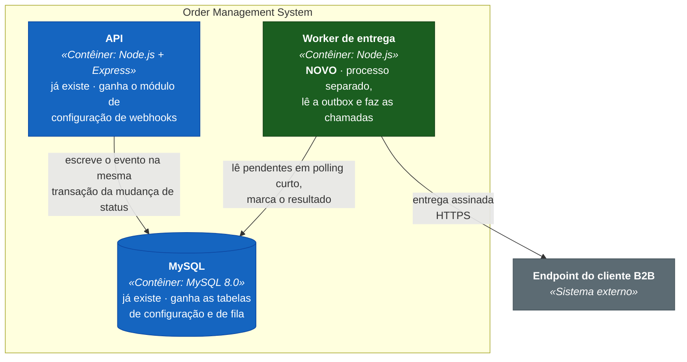

# RFC — Sistema de Webhooks de Notificação de Pedidos

## Metadados

|                   |                                                                                       |
| ----------------- | ------------------------------------------------------------------------------------- |
| **Autor**         | Larissa — Tech Lead                                                                    |
| **Status**        | **Em revisão** — aguardando a sessão anunciada em `[09:50]`                            |
| **Data**          | 2026-08-09                                                                             |
| **Revisores**     | Bruno (Eng. Pleno, Pedidos) · Diego (Eng. Sênior, Plataforma) · Sofia (Eng. Segurança) · Marcos (Product Manager) |
| **Origem**        | Reunião técnica de ~55 min registrada em [`TRANSCRICAO.md`](../TRANSCRICAO.md)          |
| **Implementação** | [`FDD.md`](FDD.md) · **Decisões** [`adrs/`](adrs/) · **Produto** [`PRD.md`](PRD.md)     |

---

## TL;DR

Três clientes B2B pediram notificação de mudança de status de pedido. Hoje eles fazem polling no `GET /orders`,
o que deixa a integração deles lenta e cara, e um deles ameaçou migrar para o concorrente se não entregarmos
neste trimestre.

Propomos **webhooks de saída sobre o padrão outbox**. Nenhuma dependência nova entra no projeto — nem fila,
nem cache, nem cliente HTTP.

Estimativa: **três sprints**, com dois dias úteis reservados no fim para revisão de segurança.

## Contexto e problema

O pedido chegou formalmente de Atlas Comercial, MaxDistribuição e Nova Cargo. Para eles, "tempo real" é
qualquer coisa abaixo de dez segundos.

O sistema hoje não tem nenhum mecanismo de notificação externa: nem eventos, nem fila, nem broker. O
`docker-compose.yml` sobe um único serviço, o MySQL.

O problema não é *detectar* a mudança: o código já sabe exatamente quando ela acontece. É **entregar essa
informação para fora sem contaminar a transação que a produz**. A mudança de status já é pesada, e Bruno
resumiu o risco de fazê-la depender de terceiros: *"qualquer cliente lento vai travar mudança de status pra
outros pedidos"*.

## Proposta técnica

### Nível 1 — Contexto

A direção é **só de saída**. Sofia levantou o escopo logo no início e Marcos fechou: *"Só saindo da gente pra
eles. Eles querem receber, não mandar."* Isso elimina toda a superfície de recepção — verificação de assinatura
de entrada, rota pública, proteção contra abuso.

### Nível 2 — Contêineres

Dois processos sobre o mesmo banco, e é essa separação que carrega a proposta.

**A API nunca faz chamada HTTP de saída.** Ela grava o evento e devolve a resposta. O contrato de
`PATCH /orders/:id/status` não muda de latência nem de comportamento por causa de um cliente lento.

**O worker roda fora da instância da API.** Diego foi explícito: *"o worker tem que rodar como processo
separado, não dentro da mesma instância da API. Senão se a API reinicia, perde o worker."*

**O MySQL é a fila.** Não subimos broker.

### Como funciona

Quatro movimentos, cada um resolvendo um problema:

**Atomicidade.** A gravação do evento acontece dentro da transação que muda o status. Se a transação commita,
o evento existe; se dá rollback, ele some junto. A recíproca também vale, e é deliberada: falha ao gravar o
evento derruba a mudança de status. Ver
[ADR-001](adrs/ADR-001-outbox-transacional-no-mysql.md).

**Desacoplamento temporal.** O worker consome em polling de intervalo curto, dimensionado com folga contra o
orçamento de latência do cliente. Um leitor único preserva a ordem por pedido. Ver
[ADR-002](adrs/ADR-002-worker-separado-em-polling.md).

**Tolerância a falha do destino.** Entrega falha é reagendada com intervalos crescentes até um teto de
tentativas; esgotado, o evento vai para uma tabela de mortos com o motivo, e um administrador pode
reprocessá-lo. Ver [ADR-003](adrs/ADR-003-retry-com-backoff-e-dlq.md) e
[ADR-008](adrs/ADR-008-controle-de-acesso-dos-endpoints.md).

**Confiança na origem.** Cada entrega vai assinada com HMAC-SHA256, com segredo próprio por endpoint
cadastrado e rotação com janela de convivência. Ver
[ADR-004](adrs/ADR-004-hmac-sha256-com-secret-por-endpoint.md).

Como a entrega é retentada, o mesmo evento pode chegar mais de uma vez. Assumimos **at-least-once** e
delegamos a deduplicação ao cliente — o padrão que Stripe e GitHub usam. Ver
[ADR-005](adrs/ADR-005-entrega-at-least-once-com-event-id.md). E o evento carrega um **retrato do pedido no
instante da mudança**, não uma referência a ele: entre a gravação e a entrega pode passar muito tempo. Ver
[ADR-007](adrs/ADR-007-snapshot-do-payload-na-insercao.md).

### O que muda no sistema atual

Um módulo novo, no formato dos que já existem, e um ponto de integração dentro da transação de mudança de
status. Ver
[ADR-006](adrs/ADR-006-reuso-dos-padroes-do-projeto.md); os caminhos exatos estão no [FDD](FDD.md).

## Alternativas consideradas

| Alternativa | O que ganharíamos | Por que foi descartada | Origem | Decisão |
|---|---|---|---|---|
| Disparo HTTP síncrono na mudança de status | Entrega imediata, zero infraestrutura nova, nenhum processo a mais para operar | A transação já é pesada; um cliente lento travaria a mudança de status de outros pedidos, e um cliente fora do ar obrigaria a escolher entre perder o evento e derrubar a operação de negócio | `[09:04] Bruno` · `[09:06] Diego` | [ADR-001](adrs/ADR-001-outbox-transacional-no-mysql.md) |
| Redis Streams ou fila dedicada | Consumo reativo, sem polling; caminho natural para escalar consumidores | Exige subir e operar infraestrutura nova. *"A gente é um time pequeno. Subir Redis Cluster pra isso é overengineering"* | `[09:07] Larissa` · `[09:07] Diego` | [ADR-001](adrs/ADR-001-outbox-transacional-no-mysql.md) |
| Trigger de banco para acordar o worker | Elimina a latência do polling | MySQL não tem `NOTIFY`/`LISTEN`: a trigger executa SQL, não notifica processo externo. As alternativas seriam improvisos, e o polling já cabe no orçamento de latência | `[09:09] Bruno` · `[09:09] Diego` | [ADR-002](adrs/ADR-002-worker-separado-em-polling.md) |
| Marcar falha definitiva na própria outbox | Uma tabela a menos | Tabela dedicada mantém a leitura da fila limpa e serve de evidência para depuração e reprocessamento | `[09:17] Larissa` · `[09:18] Diego` | [ADR-003](adrs/ADR-003-retry-com-backoff-e-dlq.md) |
| Retry indefinido, ou teto mais agressivo | Indefinido nunca perde evento; teto baixo detecta problema rápido | Indefinido deixa evento pendurado para sempre quando o cliente some. Teto baixo mata o evento antes de uma manutenção planejada terminar — já houve cliente nosso indisponível por duas horas | `[09:15] Diego` · `[09:16] Bruno` · `[09:16] Diego` | [ADR-003](adrs/ADR-003-retry-com-backoff-e-dlq.md) |
| Exactly-once | O cliente não precisaria deduplicar | Exigiria coordenação dos dois lados e complexidade desproporcional. *"At-least-once com event_id resolve 99% dos casos"* | `[09:25] Diego` | [ADR-005](adrs/ADR-005-entrega-at-least-once-com-event-id.md) |
| Segredo único da plataforma | Um segredo para gerenciar em vez de um por cadastro | *"Senão se vaza uma, vaza tudo."* Já houve cliente que vazou segredo no log da própria aplicação | `[09:21] Sofia` · `[09:22] Diego` | [ADR-004](adrs/ADR-004-hmac-sha256-com-secret-por-endpoint.md) |
| Montar o evento na hora do envio | Nenhuma duplicação de dado entre a fila e as tabelas de pedido | Com a janela de retry longa, o evento entregue carregaria o estado atual do pedido em vez do estado que ele anuncia — passaria a mentir sobre o próprio instante | `[09:51] Bruno` · `[09:52] Larissa` | [ADR-007](adrs/ADR-007-snapshot-do-payload-na-insercao.md) |

## Questões em aberto

Nenhuma bloqueia o início da implementação, e todas têm dono. Três bloqueiam o deploy: `Q04`, `Q06` e `Q07`
caem na revisão de segurança que Sofia condicionou à subida em `[09:46]`.

| # | Questão | Estado | Dono | Origem |
|---|---|---|---|---|
| **Q01** | Limitar a taxa de envio para um mesmo cliente. Um cliente com muitos pedidos mudando em pouco tempo recebe uma rajada de chamadas | *"A gente observa e implementa se virar problema"*. Reabrir quando o histórico de entregas mostrar rajadas ou quando um cliente reclamar | Diego | `[09:38]` · `[09:39]` |
| **Q02** | Escalar para múltiplos workers, e o que acontece com a ordem por pedido | Adiado. Opções levantadas: particionar por pedido ou usar lock pessimista. *"Mas isso é problema do futuro, não agora"* | Diego | `[09:13]` |
| **Q04** | Endurecer a autorização do cadastro de webhooks. Hoje qualquer usuário autenticado opera sobre qualquer cliente, porque não existe vínculo entre usuário e cliente no modelo de dados | *"Por enquanto sim. Mais pra frente a gente pode endurecer"* | Sofia | `[09:37]` |
| **Q05** | Retenção e expurgo das linhas já entregues e do histórico de tentativas | *"Fora do escopo dessa feature"*. Reabrir quando o volume da tabela pesar na leitura ou no backup | Diego | `[09:08]` |
| **Q06** | Guarda do segredo em repouso: texto claro ou cifrado | Não foi tratado na reunião. Item obrigatório de pauta da revisão de segurança | Sofia | `[09:46]` |
| **Q07** | Escopo da assinatura. O cabeçalho de horário fica fora do trecho assinado, seguindo a decisão ao pé da letra, o que o torna adulterável — a proteção contra reenvio recai sobre a deduplicação pelo identificador de evento | Não foi levantada na reunião; derivou da análise deste RFC. Levar à revisão de segurança junto com `Q06` | Sofia | `[09:22]` · `[09:44]` |

## Impacto e riscos

Entra um processo novo para operar — Diego pediu o worker fora da instância da API em `[09:11]` — e a
transação do `changeStatus` ganha mais um gate. Infraestrutura nova, nenhuma: Redis ficou de fora em
`[09:07]`, e o MySQL faz de fila.

**O ponto de integração fica dentro da transação mais quente do sistema.** É a consequência direta e desejada
da atomicidade, mas significa que um defeito no módulo novo pode derrubar a mudança de status — a operação
central do OMS. É o único risco da feature capaz de causar dano fora dela, e o desenho de implantação precisa
tratá-lo com gate próprio e ordem de subida definida.

**A promessa de "abaixo de dez segundos" não fecha como garantia absoluta.** Somando a espera do polling ao
tempo de resposta de um cliente que chegue perto do limite de timeout, uma entrega **bem-sucedida** ultrapassa
a janela prometida sem que nada tenha falhado. O compromisso, portanto, precisa ser percentil sobre a primeira
tentativa, não teto absoluto — e o [PRD](PRD.md) o formula assim.

**A janela de retry é longa.** Quase quinze horas da primeira falha à última tentativa, aceito
conscientemente: *"se um cliente meu cair por 15 horas, ele já tá com problema sério dele"*. Duas
consequências: um endereço cadastrado errado ocupa a fila por todo esse período antes de aparecer na fila de
mortos, e a chegada lá não dispara aviso ativo, porque alerta por e-mail ficou fora desta fase.

**Nenhum usuário está vinculado a um cliente.** Qualquer operador autenticado pode cadastrar um webhook para
qualquer cliente e receber, na resposta, um segredo de assinatura válido para ele. Aceito como `Q04`, e é o
maior buraco do desenho.

## Decisões relacionadas

| ADR | Decisão |
|---|---|
| [ADR-001](adrs/ADR-001-outbox-transacional-no-mysql.md) | Padrão outbox no MySQL para publicação de eventos |
| [ADR-002](adrs/ADR-002-worker-separado-em-polling.md) | Worker em processo separado consumindo por polling |
| [ADR-003](adrs/ADR-003-retry-com-backoff-e-dlq.md) | Retry com backoff e dead letter queue em tabela dedicada |
| [ADR-004](adrs/ADR-004-hmac-sha256-com-secret-por-endpoint.md) | HMAC-SHA256 com segredo único por endpoint |
| [ADR-005](adrs/ADR-005-entrega-at-least-once-com-event-id.md) | Entrega at-least-once com deduplicação delegada |
| [ADR-006](adrs/ADR-006-reuso-dos-padroes-do-projeto.md) | Reuso dos padrões existentes do projeto |
| [ADR-007](adrs/ADR-007-snapshot-do-payload-na-insercao.md) | Snapshot do payload na inserção e filtro na origem |
| [ADR-008](adrs/ADR-008-controle-de-acesso-dos-endpoints.md) | Replay de dead letter restrito a ADMIN |

As oito foram fechadas na própria call — `[09:48]` Larissa recapitula, `[09:49]` Diego, Bruno e Sofia
aceitam —, e o que ainda não aconteceu é a sessão sobre o documento de design marcada em `[09:50]`: decisão
aceita e proposta escrita em revisão são coisas diferentes.

---

**O que se pede desta revisão:** validar a proposta acima antes do início da implementação, com atenção
especial ao gate de implantação do ponto de integração e à formulação da métrica de latência.
