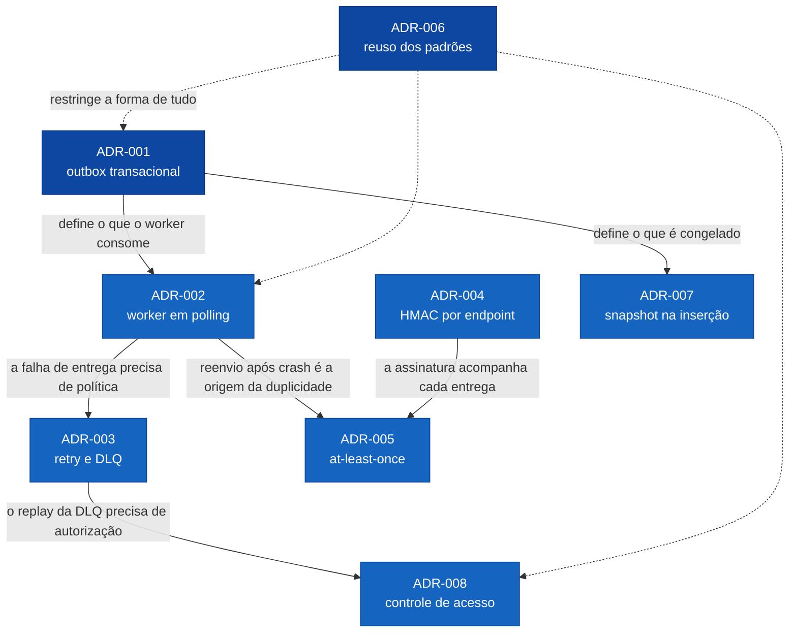

# Architecture Decision Records

Decisões arquiteturais da feature **Sistema de Webhooks de Notificação de Pedidos**, cada uma num arquivo
próprio, no formato MADR.

Todas foram tomadas na reunião técnica registrada em [`TRANSCRICAO.md`](../../TRANSCRICAO.md) e confirmadas no
resumo final da Larissa em `[09:48]`, com o aceite explícito de Diego, Bruno e Sofia em `[09:49]`.

## Índice

| ADR | Decisão | Origem |
|---|---|---|
| [ADR-001](ADR-001-outbox-transacional-no-mysql.md) | Padrão outbox no MySQL para publicação de eventos de pedido | `[09:06] Diego` |
| [ADR-002](ADR-002-worker-separado-em-polling.md) | Worker em processo separado consumindo a outbox por polling | `[09:09]` · `[09:11] Diego` |
| [ADR-003](ADR-003-retry-com-backoff-e-dlq.md) | Retry com backoff exponencial de 5 retentativas e dead letter queue em tabela dedicada | `[09:15]` · `[09:17]` · `[09:18]` |
| [ADR-004](ADR-004-hmac-sha256-com-secret-por-endpoint.md) | Autenticação de origem com HMAC-SHA256 e secret única por endpoint | `[09:20]` · `[09:21] Sofia` |
| [ADR-005](ADR-005-entrega-at-least-once-com-event-id.md) | Entrega at-least-once com idempotência delegada ao cliente via `X-Event-Id` | `[09:24]` · `[09:25] Diego` |
| [ADR-006](ADR-006-reuso-dos-padroes-do-projeto.md) | Reuso dos padrões existentes do projeto no módulo de webhooks | `[09:27]` · `[09:30] Larissa` |
| [ADR-007](ADR-007-snapshot-do-payload-na-insercao.md) | Payload materializado como snapshot na inserção e filtragem de destinatários na origem | `[09:34]` · `[09:52] Larissa` |
| [ADR-008](ADR-008-controle-de-acesso-dos-endpoints.md) | Replay de dead letter restrito a ADMIN e CRUD de configuração apenas autenticado | `[09:36] Sofia` |

## Como as decisões se sustentam

## Nota sobre o status

Os oito ADRs estão como **Aceito**, enquanto o [RFC](../RFC.md) está como **Em revisão**. Isso é intencional e
não é incoerência de estado.

As decisões foram fechadas na própria call. A Larissa recapitula tudo em `[09:48]` e pergunta *"Algo errado ou
faltando?"*. Em `[09:49]`, Diego responde *"Tá fechado"*, Bruno diz *"Pra mim ok"*, Marcos *"Tá bom"* e Sofia
fecha com uma ressalva de processo, não de conteúdo: *"Ok, só não esqueçam de me agendar pra revisão de
segurança antes de subir."*

O que ainda não aconteceu é a **sessão de revisão do documento de design**, anunciada pela Larissa logo depois,
em `[09:50]`: *"Eu vou abrir o doc de design da feature e marcar uma sessão pro Bruno e o Diego revisarem
comigo antes da gente começar a codar."*

Decisão aceita, proposta escrita ainda em revisão. Duas coisas diferentes.

Duas decisões carregam pendência formal registrada, ambas com dono e prazo na revisão de segurança que a Sofia
pediu em `[09:46]`: a guarda do secret em repouso e o escopo da string assinada. Estão em
[ADR-004](ADR-004-hmac-sha256-com-secret-por-endpoint.md) e no RFC como `Q06` e `Q07`.

## O que deliberadamente não virou ADR

Nem toda decisão técnica é arquitetural. A própria reunião desqualificou algumas, e registrar essa subtração é
o que impede esta pasta de inflar até estourar o teto do desafio.

| Item | Por que não é ADR | Onde vive | Desqualificação |
|---|---|---|---|
| Limite de 64 KB no payload | A Larissa classifica na hora | PRD, como requisito não funcional | `[09:24] Larissa`: *"Anotado, mas não vejo como decisão arquitetural separada, é só requisito não funcional"* |
| HTTPS obrigatório na URL | A própria Sofia desqualifica ao propor | FDD, na validação Zod do schema | `[09:23] Sofia`: *"Isso na verdade nem é decisão arquitetural, é só uma validação no schema Zod"* |
| Timeout de 10 s por tentativa | Parâmetro da política de entrega, não decisão isolada | [ADR-003](ADR-003-retry-com-backoff-e-dlq.md) e FDD | `[09:42] Diego` — decidido em uma linha, sem alternativa discutida |
| Intervalo de polling de 2 s | Parâmetro do modo de consumo, não decisão isolada | [ADR-002](ADR-002-worker-separado-em-polling.md) | `[09:09] Diego` — dimensionado contra o requisito de `[09:02]` |
| Conjunto de headers do envio | Detalhe de contrato público | FDD | `[09:44] Diego` e `[09:44] Sofia` — enumeração, não escolha entre opções |
| UUID como identificador | Segue o padrão já estabelecido no projeto | [ADR-006](ADR-006-reuso-dos-padroes-do-projeto.md) | `[09:51] Larissa`: *"UUID, segue o padrão do resto do projeto. Tudo é uuid."* |

## Formato

Variante do [MADR](https://adr.github.io/madr/). Cada arquivo traz Status, Contexto, Decisão, Alternativas
Consideradas e Consequências, além de duas seções que este pacote acrescenta:

- **O que este ADR não cobre** — com link para o ADR dono de cada assunto adjacente. Existe para que a
  fronteira entre decisões seja explícita e o conteúdo não se repita.
- **Limitações conhecidas** — cada uma com o **gatilho de reabertura** nomeado, para que o ADR diga em que
  circunstância ele mesmo deve voltar à mesa.

Alternativas que não foram levantadas na reunião, quando incluídas para contraste, vêm rotuladas como análise
deste pacote e são refutadas apenas com restrições que a reunião de fato impôs.

## Rastreabilidade

A origem de cada item está em [`docs/TRACKER.md`](../TRACKER.md). A base de fatos que sustenta todos os
documentos está em [`docs/processo/FATOS.md`](../processo/FATOS.md).
